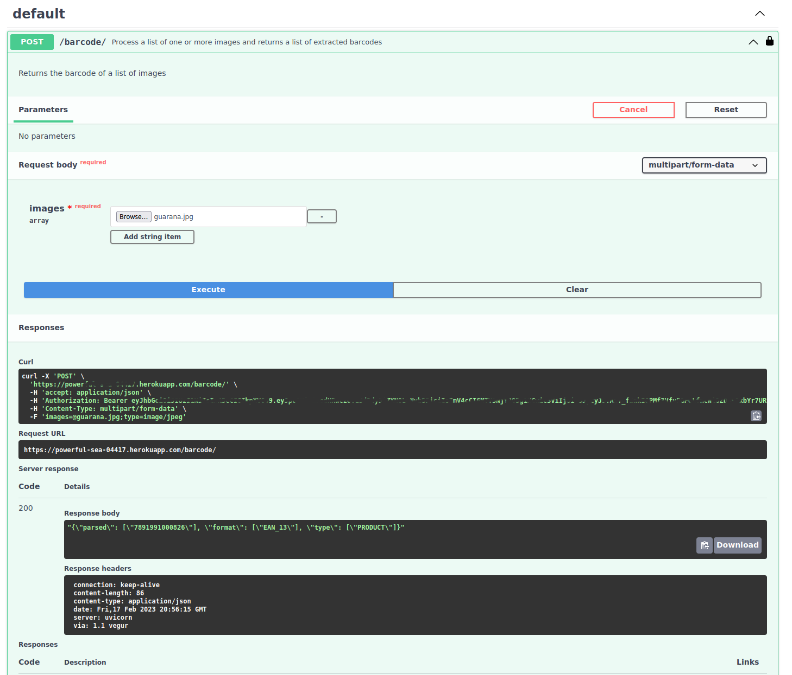
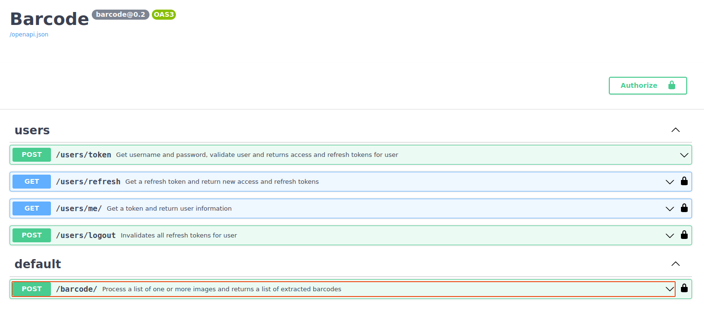
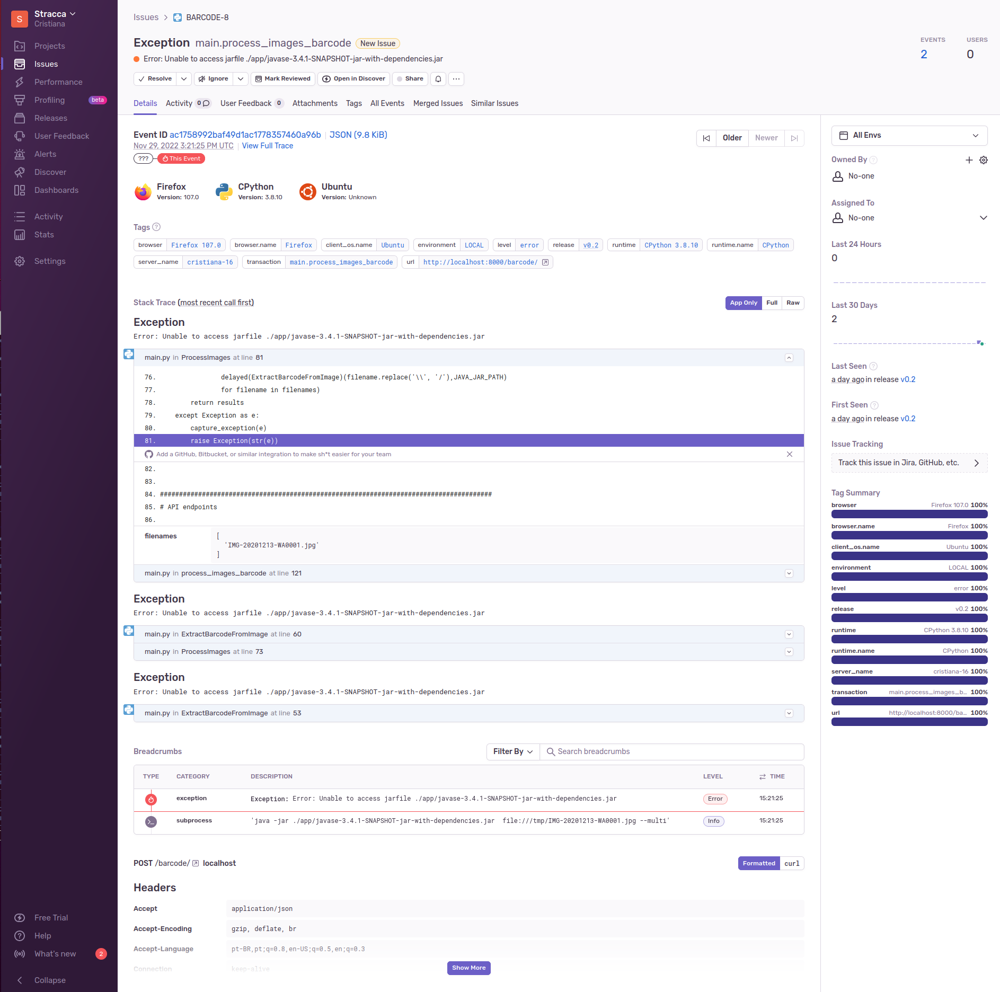
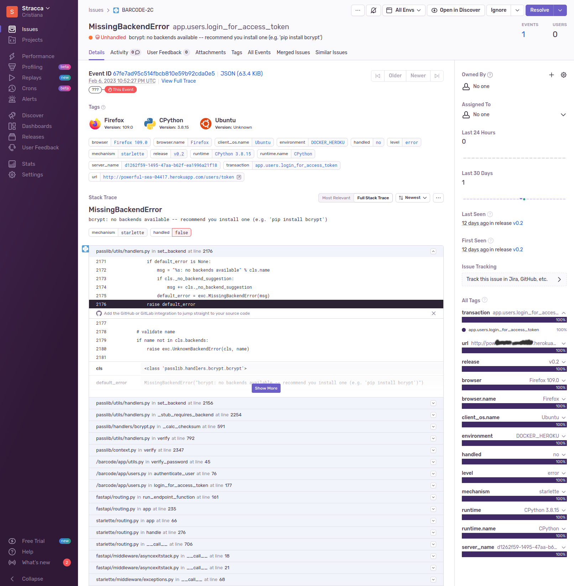
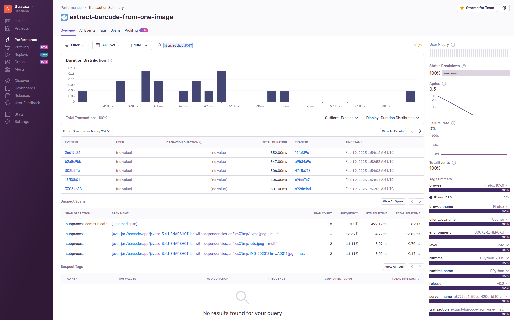
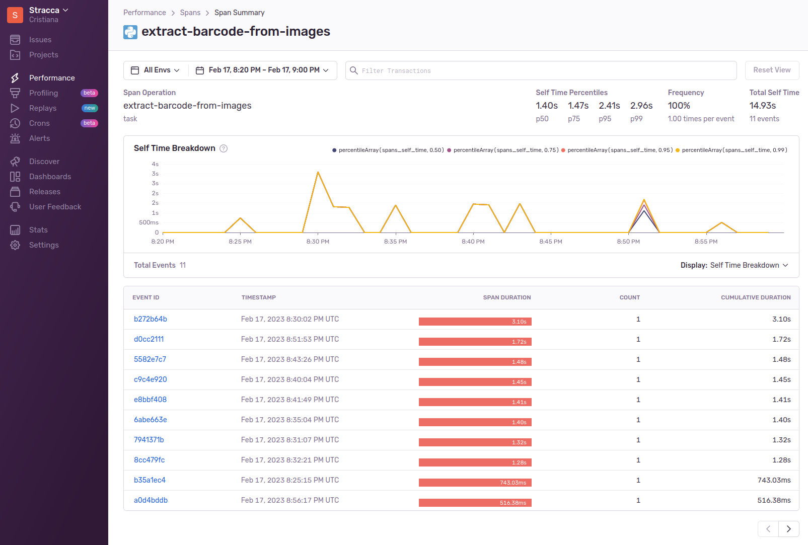
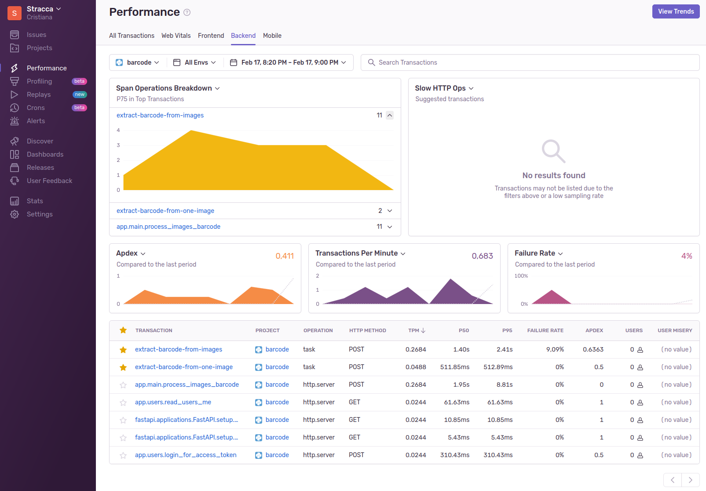
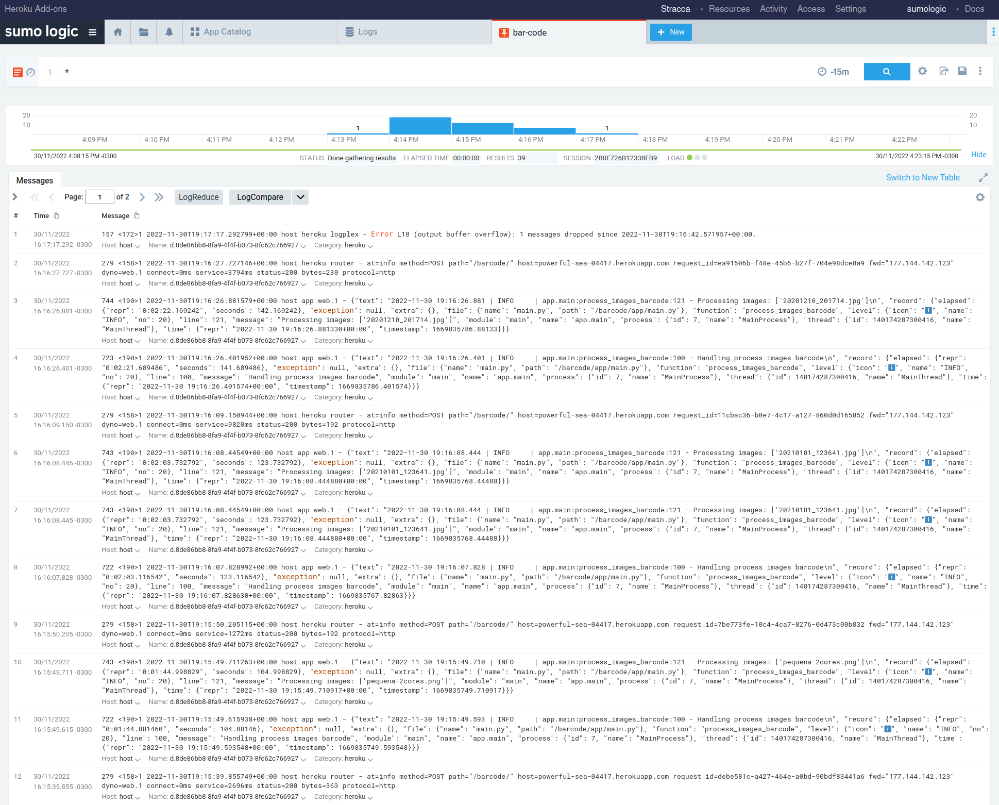

[BACK TO INDEX](https://cristianasp.github.io)

---

# Barcode Reader API
## 
A Python wrapper of [ZXing library](https://github.com/zxing/zxing)

A python API that wraps a java program that extracts barcode from images.

## 👉🏻 About Barcode Reader 

One of my side projects involves extracting barcode number from photos of products.

I found several payed services to extract the barcode. I also found some python libraries in github, tried to implement them but it looked so complicated and the code was quite messy, at least for me. Finally I found a java library that was perfect for what I needed.

## 👉🏻 The Barcode Reader API

ZXing ("Zebra Crossing") barcode scanning library for Java is available since 2014 and now is in maintanence mode:
https://github.com/zxing/zxing

I tested it and it worked just fine. I did not have time to develop this library by myself, maybe some day - who knows... so I decided to move on with this one.

Since I am a python programmer, not a java programer, I set myself a challenge to integrate this java library into an API written in Python. 

That was something interesting to give a try... Challenge accepted!


## 🌟 Project development

### The core funcionality

I am a huge fan of fastapi, not just because it is a great library that delivers fast apis 😂, but also because this project has a fabulous documentation and is fully supported by a great open-source community. As of Jan, 2023, it has 54 thousand stars and more than 400 contributors. https://github.com/tiangolo/fastapi

The main goal of the Barcode Reader API is to receive one image or several images, process the images and returns the barcode number, if detected, of those images.

Here is an example of an image:


And the API running and extracting the barcode from the image:




Here is the solution that I have developed: the API writen in python receives a request with the images, performs some tricks in the images (for better recognition), saves the images in a temporary directory, and calls the java library (via subprocess.Popen), that reads the file, extracts the barcode and returns the results in stdout. The python subprocess rotine inspects the process stdout, verifyes stderr and returns the results in the API response.

In the API use-case, I needed to process several images at once, so the API was designed to receive one or more images in each request. If there is more than one image in the request, the API function calls subprocess.Popen using joblib.Parallel for each image.

As a result, the overall processing time for several images is less than the sum of processing each image, as the log and trace that I have set reveals:

```
 "message": "DEBUG | Returning ProcessImages(filenames=['20201213_202427.jpg', 'cafe1.jpeg', 'coca.jpg', 'gato.jpg', 'creme.jpeg']) in 1.8243 secs with ['{\"parsed\": [\"7908016652370\"], \"format\": [\"EAN_13\"], \"type\": [\"PRODUCT\"]}', '{\"parsed\": [\"7898912704085\"], \"format\": [\"EAN_13\"], \"type\": [\"PRODUCT\"]}', '{\"parsed\": [\"5449000000996\"], \"format\": [\"EAN_13\"], \"type\": [\"PRODUCT\"]}', '{\"parsed\": [\"4607047610696\"], \"format\": [\"EAN_13\"], \"type\": [\"PRODUCT\"]}', '{\"parsed\": [\"7891000120101\"], \"format\": [\"EAN_13\"], \"type\": [\"PRODUCT\"]}'] "

2023-02-07 13:12:11.502 | INFO | app.main:wrapper:73 - DEBUG | Returning ExtractBarcodeFromImage('creme.jpeg') in 1.0119 secs with '{"parsed": ["7891000120101"], "format": ["EAN_13"], "type": ["PRODUCT"]}'

 2023-02-07 13:12:11.435 | INFO | app.main:wrapper:73 - DEBUG | Returning ExtractBarcodeFromImage('gato.jpg') in 1.0590 secs with '{"parsed": ["4607047610696"], "format": ["EAN_13"], "type": ["PRODUCT"]}'

2023-02-07 13:12:11.187 | INFO | app.main:wrapper:73 - DEBUG | Returning ExtractBarcodeFromImage('cafe1.jpeg') in 1.0235 secs with '{"parsed": ["7898912704085"], "format": ["EAN_13"], "type": ["PRODUCT"]}'

2023-02-07 13:12:11.156 | INFO | app.main:wrapper:73 - DEBUG | Returning ExtractBarcodeFromImage('coca.jpg') in 0.8784 secs with '{"parsed": ["5449000000996"], "format": ["EAN_13"], "type": ["PRODUCT"]}'

 2023-02-07 13:12:10.852 | INFO | app.main:wrapper:73 - DEBUG | Returning ExtractBarcodeFromImage('20201213_202427.jpg') in 0.7933 secs with '{"parsed": ["7908016652370"], "format": ["EAN_13"], "type": ["PRODUCT"]}'
```

In the log above, extracting the barcode sequentialy for each image would take at least 1.0119+1.0590+1.0235+0.8784+0.7933 = 4.7661 seconds. Since the API uses parallel processing, it took just 1.8243 seconds.

After returning the response, there is a background task (a fastapi functionality) that is executed after the API response, that deletes the images in the temporary directory.


### Secure the api

Next step was security. I had to protect the endpoint from unauthorized usage.

To enable authentication and authorization, I implemented the flows based on oauth 2.0 and openid connect, using some resources that are available in fastapi.security. With these flows, the API can serve access tokens and refresh tokens after the user logs in with username and password.

At that moment there was only one user (myself), so I stored my user information in secrets. Later would move it to a database.

Regarding the refresh tokens, I implemented refresh token rotation, meaning that a refresh token can be used only once. Most implementations to revoke tokens or revoke refresh tokens that I have read about are based on a negative list, meaning that they have the revoked tokens in a list.  I decided to implement in a simpler way, storing the refresh tokens with the user information and removing them when they were consumed. In more complex applications, token management should be implemented in a redis database or a no-sql database with automatic expiration, but that is not the case here.

So I ended up with 3 endpoints to implement security:
- [ ] `token` : user logins and receives access and refresh token
- [ ] `refresh` : application gets new tokens from refresh token
- [ ] `logout` : clears all user tokens

And the `barcode` endpoint has a depency that validates if the user is authenticated.

Ah, `me` endpoint is just and endpoint to check user information.




### Put it in a container

Once I had the code up and running and fully tested, I improved the solution making a container for the API, so I could deploy and run it in a much simpler way.

There was an additional challenge to create the docker image: which image should I use as base image? Linux with java or linux with python? Certainly there would be no image in docker hub with **both** java and linux.... 

I tried several combinations of Linux, java and python. The final Dockerfile receipt started with a debian-slim [image with java sdk](https://hub.docker.com/r/adoptopenjdk/openjdk11). Then I added the receipt to [install python 3.8 on debian](https://github.com/docker-library/python/blob/411236ac68fc3cc594d04c1aafbdf8e39c984a6c/3.8/slim-bullseye/Dockerfile) and finally added the instructions to deploy my Fastapi API on top of it. Used gunicorn to run the "app".

I also made sure to have all the `secrets` in environment variables, making it more secure. I also created some variables like `run-mode` to make easier to run the same code localy, in a local container or in a container in the cloud.

And of course, it is quite important to have all the libraries listed and locked in the Pipfile, in order to guarantee the same library versions at each deployment.

### Cloud deployment 

Since this was a side project with several services yet to be developed, I needed to find a cloud solution provider that would allow me to deploy a container and run it ocasionaly and charge me zero or a few dollars.

I decided to use Heroku's Web Dyno. The Eco Dyno costs $5 for 1000 hours/month (on Feb 2023).

Easy deployment via heroku CLI and heroku container registry: 

```
docker build .
heroku login
heroku container:login

# Set environment variables
heroku config:set BARCODE_RELEASE=barcode@0.X

# push container
heroku container:push web

#relase container
heroku container:release web

heroku open
heroku logs --tail
```

Heroku also offers automated pipelines using heroku git, github or the container registry (the case above).

The environment variables can be set using heroku cli or directly in the web dashboard.

So it ended up being very easy to deploy the API, more than I expected.

### Error, logging and performance monitoring

Next challenge was regarding monitoring the API for unexpected errors. 

Because this application has python-java interaction using the slowest possible solution (writing and reading a file), I was very curious about the API performance. I wanted to measure the end-user experience, the total time to process an image.

And last, I wanted logs that I could inspect if I needed.

Errors, metrics and tracing are the three pilars of observability. There are several approaches to implement observability, from simple libraries in python to full-cloud solutions with dedicated agents installed in your application.

I used Sentry (www.sentry.com) for capturing errors. Sentry does not recommends to capture 100% of errors, but a percentage of them. To implement this, you have to include the library and write few lines of code.

Here are examples of errors that were triggered and captured by sentry:







I also used sentry to measure transaction time. I created metrics for extracting barcode from each image, and extracting the barcode from a list of images (5 images aprox). That is implemented using `tasks` in sentry.





Good news was that that the eco dyno was performing the same as running in my ubuntu desktop.

Overall performance:



But Sentry is **not** recommended for logging. 

Regarding logs, I had two main goals:

- log function calls to process images: in order to achieve this, I created a decorator in python that creates a log entry and computes the execution time of the function. One decorator that works for all functions.

- log api calls: to implement logging for the API endpoints, it is not recommended to use decorators, but a middleware, according to [this](https://fastapi.tiangolo.com/tutorial/middleware/ ) documentation.

So the API was producing the intended logs, next challenge was finding a good logging solution as a cloud service, that would receive all my logs and would allow me to inspect them.

I tried datadog and newrelic. Great solutions. The problem is that they require an agent to be installed in your infrastructure. And Datadog documentation was quite confusing, New-relic is much better. Since I was using eco-dynos in Heroku (the dyno should sleep in order to not get billed), installing agents as services was not what I intended to do.

Eventualy I found a add-on in Heroku, called Sumologic, just selected it and... all done!

Here is an example of the logs in sumologic:



## 🎁 Wrapping-up

So my goal was achieved: I was able to setup an API that processes images and returns their barcode number, with security (authentication) and observability (logs, metrics and traces using sentry and sumologic), easy deployed to Heroku dynos using docker!


## 😎 Project challenges:

- [ ] find code that extracts barcode from images
- [ ] run java from python
- [ ] set up an api using fastapi
- [ ] upload and process images
- [ ] delete alll processed images using async background tasks
- [ ] api security: autentication and authorization flow with oauth
- [ ] create, renew and revoke: access tokens & refresh tokens
- [ ] observability: have logs, metrics and traces
- [ ] tools to inspect logs
- [ ] easy deployment with docker image
- [ ] free or cheap cost for hosting 


## 🛠 Technical resources:

- java sdk
- python 3.8
- joblib
- fastapi
- gunicorn
- sentry
- loguru
- python-json-logger
- python-jose
- bcrypt
- docker
- docker-compose
- heroku

---

[BACK TO INDEX](https://cristianasp.github.io)

---