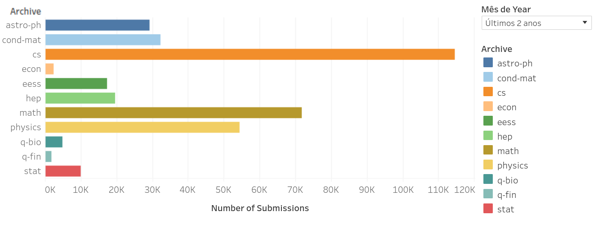

# An Overview of Machine Learning & Artificial Intelligence

**Translated to English by Gemini-1.5-flash and ChatGPT4**

This article serves as the basis for a talk I gave with some professors from a business school in Brazil in April 2023.

AI-generated image

---

# 1992: Turing and PROLOG

The year was 1992. It was one of the first classes of the "Computer Engineering" course at UNICAMP. And I was going to have a class on "Introduction to Artificial Intelligence," a new subject in the new course. The professor presented some topics on the subject over 4 months. A few things stuck in my head. It was very few, because there wasn't much material for the classes. What could you talk about Artificial Intelligence at the time?

I remember two topics that were covered throughout the classes: the Turing test and PROLOG programs.

The Turing test was proposed in 1950 by Alan Turing. The goal of the test is to identify whether the interviewer is talking to a person or a machine. The conversation is through typing text. Its premise is that if a machine could imitate a human being so convincingly that a third of its interlocutors believed they were talking to another human, this machine would be considered "thinking" and it would pass the test.

PROLOG is one of the first languages associated with artificial intelligence, it was created in 1972. Briefly, PROLOG is a language that allows logical associations to be made. At the end of the semester, we were able to make a program that could conclude some relationships between words based on some rules.

And I thought: How can a program in PROLOG evolve into something similar to an intelligent conversation? How will the program be able to understand a sentence and from it extract the meaning and respond, imitating a human being?

And I thought: I don't think I'll live to see that... Well, I was wrong." 

---

## What happened in those 30 years?

**More machines, more memory, more data**

From the 1990s to 2020, there was an exponential growth in the capacity for storing, processing, and transmitting information. Not to mention, of course, the exponential growth in information generation.

The numbers are almost impossible to imagine.

**Moore's Law** is based on the observation that the number of transistors in a microprocessor doubles every two years. In layman's terms, a transistor can be understood as the atom of a circuit (or computer), in the sense that it can turn an electrical signal on or off (the famous 0 or 1).

We measure the processing power of a computer in **FLOPS**: floating point operations per second. It's an arithmetic operation with a real number, and it's considered the best indicator of a computer's processing capacity.

The decrease in storage and processing costs allowed a large part of the world's population to access the internet. With access, more information began to be shared and stored in services, generating databases with texts, images, and videos that would later be used as data for Artificial Intelligence.

**Global Internet Information Traffic**

For perspective: there are 1 zetta stars in the universe...

**More available data and Moore's Law were the catalysts for the AI revolution, which began in 1958 but exploded around 2010.**

The final ingredient in this recipe for success is the evolution of theory related to Machine Learning and the considerable increase in the production of academic work.

**arXiv** is a free and open distribution service that has received, since 2009, 2 million academic articles in the areas of physics, mathematics, computer science, quantitative biology, quantitative finance, statistics, electrical engineering and systems science, and economics. The materials on this site are not peer-reviewed by arXiv.

See below the growth of articles related to computer science (cs - in orange), over the last 30 years and the last 2 years:

And in computer science, the exponential growth of publications:

It's worth noting the large number of articles published recently on the topics highlighted below:

cs.AI :Artificial inteligence https://arxiv.org/list/cs.AI/recent

cs.CL: Computation and Language https://arxiv.org/list/cs.CL/recent

cs.CV: Vision and Patter Recognition https://arxiv.org/list/cs.CV/recent

cs.HC: Human-Computer Interaction https://arxiv.org/list/cs.HC/recent

cs.LG: Machine Learning https://arxiv.org/list/cs.LG/recent

**But what is Machine Learning?**

"A field of study that gives computers the ability to learn without being explicitly programmed" Arthur Samuel, 1959

Image produced by artificial intelligence (openAI), with the text of the definition of machine learning above.

Until the end of the last century, it was possible to program a machine to perform tasks and calculations to solve problems. But there were some types of problems that were difficult to solve through programming.

There was an insight that the only way to solve these problems was to make a machine learn to solve them on its own. Inspired by concepts from statistics, fuzzy logic, and probability theory, machine learning emerges.

Tom M. Mitchell, 1997, provided a more formal and widely cited definition:

"A computer program learns from experience E with respect to some class of tasks T and has a performance P if its performance on tasks T, as measured by P, improves with experience E."

E - experience: real data
T - task: the result of a goal
P - performance: a way to measure if the goal was achieved

Machine learning is a field of artificial intelligence whose goal is to solve problems in a practical way.

Some examples of machine learning:

* Estimate future stock prices
* Identify fraudsters
* Identify and extract information from images
* Self-driving cars
* Text translation
* Identify patterns in large amounts of data: medical data, biology - genome
* Personalized recommendations: Amazon, Netflix

Therefore, to solve the problems above, the traditional computing approach is to build a program with operations and calculations, which need to be known and coded. The machine learning approach is to build a program that generates an estimate of the result of the problems above, based on real data collected. To do this, there will be a learning step, which will use an iterative strategy, where with each iteration, the estimate will improve.

#  **How does the machine learn?**

	DALL-e: A futuristic style picture of a man teaching a robot how to build a house.

Machines can learn using various strategies, these being the main ones:

* **Supervised Learning:** We will teach the machine to learn, based on examples of real data and the results obtained.

* **Unsupervised Learning:** The machine will learn on its own and will identify patterns in the real data.

* **Reinforcement Learning:** We will reward it according to the success of its autonomous learning. 

---

## Applications for Supervised Learning

We use supervised learning to solve these types of problems:

**Regression Problem:** We want to predict future outcomes based on known data. 
**Examples:** Estimating the price of new houses based on data from known houses (number of bedrooms, neighborhood, area, price). In this case, we have continuous data.

**Classification Problem:** We want to know the probability of a measurement belonging to a known class. 
**Examples:** Identifying whether an email message is SPAM or not SPAM, identifying fraud, identifying tumors in images. In this case, we have discrete values.

**Binary Classification (yes and no)**

- Identifying spam
- Identifying fraudulent transactions
- Identifying tumors in images

## Applications for Unsupervised Learning

Unlike Supervised Learning, there isn't just one correct answer!

We use unsupervised learning when we want to solve these types of problems:

**Clustering Problem:** The conversation is: "Machine, here's the data, can you find some 'structure' in this data?"

**Examples:** Grouping social media users into similar profiles, grouping news into topics, grouping humans into genetic groups, segmenting customers for marketing actions, etc.

	"A top view of a social network where each node is a person and each person has a different color"

**Cocktail Party Problem:** Audio processing to remove background noise, finding a "structure" in data that we don't know. 

  "A vintage image of one man e one woman singing in an antique microphone, each one holding its own microphone"

## Applications for Reinforcement Learning

Reinforcement learning is a type of machine learning that aims to maximize rewards through trial and error in an environment.

Or, in more detail: 

"Reinforcement Learning (RL) is the science of decision-making. It's about learning the optimal behavior in an environment to achieve maximum reward. This optimal behavior is learned through interactions with the environment and observations of how it responds, similar to children exploring the world around them and learning the actions that help them achieve a goal.

In the absence of a supervisor, the learner must independently discover the sequence of actions that maximize reward. This discovery process is similar to trial and error. The quality of actions is measured not only by the immediate reward they return but also by the delayed reward they may seek. Because it can learn the actions that result in eventual success in an unseen environment without the help of a supervisor, reinforcement learning is a very powerful algorithm." Richard Sutton

	image from https://www.synopsys.com/ai/what-is-reinforcement-learning.html

Very common examples of use: robotics and games

	image from https://www.youtube.com/watch?v=L4KBBAwF_bE

---

# How are Machine Learning problems solved?

To solve a machine learning problem, you need to "train a model". Once the model is trained, it can be used to make new predictions.

For training, we will need:

- data

- define a model

- define how we will evaluate the performance of our model

- define the algorithm for training

## Data

Machine Learning requires a lot of data: many measurements of real-world examples, with many variables. Variables can be measured or created from the combination of existing variables. The more, the better.

Current numbers: 600 million images, 450 billion words

## Model

Let's start with a simple example, we want to estimate the price of a house, using the **single-variable linear regression model**. Our equation is `a+bx=y`. We start with data samples, which are measurements of `x` and `y`. Our process is to try to figure out `a` and `b` so we can estimate new values of `x` and `y`.

Now a slightly more complex problem, we want to classify images of tumors into 2 values (yes or no for cancer), we could also use linear regression, but it is too "simple" and we need more sensitivity to small changes in the variables.

We will use **logistic regression**, which calculates the `probability` of the outcome being `1`, given a variable `x`, choosing values `a` and `b`. Thus, the model's output is probabilities, and from there it is possible to choose the cut-off point (decision boundary) to consider 0 and 1 (usually 0.5).

There are many other models that can be used in machine learning.

## Model Performance

During training, how will we know if the chosen `a` and `b` are good? We want to minimize the sum of the errors of each calculated `y` result from all data examples, varying `a` and `b`.

For linear regression, we use a mathematically more efficient function than the simple sum of errors, which is the sum of squared errors function (squared error function). There is a very important characteristic in the format of the error function: this function is chosen so that it always has a minimum value.

For logistic regression, we need another function for the error. If we use the sum of squared errors, we will have a non-convex function, with several local minima. We need a convex function for the cost function. 

We use a function that has the following format:
`-y log (f(x)) - (1 - y) log (1 - f(x))`
This function is convex, trust me. 

## Algorithm for Training

What do we want to do? We want to find values for the coefficients of the function whose calculated result is as close as possible to the real result, that is, we want to minimize the error.

**Thus we arrive at the objective of the machine learning algorithm, which is to solve a minimization / optimization problem.**

And for that we need an error function that has a minimum value. Below is an example of the three-dimensional view of a function with two variables. 

But how to find the values of the function coefficients that minimize the error function? The algorithm widely used in Machine Learning is called **Gradient Descent**.

It works like this:
- choose a value for `a` and `b` and calculate the error function.
- change `a` and `b` and calculate the function and see if the function has decreased.
- repeat the above steps until it stops decreasing.

Trick:
- to choose a new value for `a` and `b`, the tip is to do the calculation using the gradient descent algorithm. This step has two important choices that need to be made: the `step size` (learning rate) and the `step direction` (derivative of the error function with `a` and `b` at this point).

A note: adding more variables to solve linear regression problems only increases the dimension and in this case we start using matrices and vectors.

Another note: Algorithms have several parameters that need to be defined, but we'll keep things simple here. 

---
# Summary, please ...

In conclusion, we are working with mathematical calculations to find values for variables that represent an unknown function, which when applied, will have results as similar as possible to the data used to "train" our model.

The calculation is almost by trial and error. We start from a random initial situation (or almost that) and follow steps to optimize the error function (err less). We rely on mathematics to help us and take the right size steps, in the right direction. 

	 "A top view of several men walking in different directions in several roads that all converges to a unique red point in the middle of the view"

	"A top view of several men walking in different directions in several roads that all converges to a unique red point in the middle of the view"

---

# Overfitting and Underfitting

This topic is rarely discussed, but it is extremely important.

Underfitting or high bias occurs when the estimation function poorly maps the trend of the data. It is usually caused by a function that is too simple or uses too few variables.

Overfitting or high variance occurs when the estimation function fits too closely to the available data, but does not generalize well to predict new data. It is usually caused by a complicated function that creates many unnecessary curves and angles, which are related to outliers.

Our training data: 

Training with a very simple function (underfitting):

Training with a very complex function (overfitting):

Good training (ideal function and function found):

	images from https://www.kaggle.com/code/jhoward/getting-started-with-nlp-for-absolute-beginners

Therefore, training data is extremely important in machine learning. Biased data leads to biased models. Data with little variation leads to a model that does not represent reality. And incorrectly trained models are good for training data and terrible for new predictions.

That's why there are Machine Learning engineers, who take care of this and many other details...

And we can never forget that models **always** deal with probabilities and are estimates. They will never get everything right. They will make mistakes. 

---

# How did neural networks arise?

In the 1980s, several studies were conducted on the brains of animals, and surprisingly it was found that the same brain tissue could be connected to any brain sensor and learn new functions related to the new sense. The hypothesis was that if the same brain tissue could process sound or touch or vision, there should be an intrinsic and "generic" algorithm in the neuron that allowed it to process sound or touch or vision. And therefore, instead of having differentiated cells with specialized functions, the brain was composed of similar units, with the same single learning algorithm.

The idea was to identify this brain learning algorithm and reproduce it digitally. An algorithm approximating the animal process seemed promising and represented real progress towards artificial intelligence and the dream of building intelligent machines.

This idea was widely discussed throughout the 1980s and 1990s, but due to the technological limitations of the time, as already presented, its popularity declined in the late 1990s. But from 2012 onwards, neural networks resurfaced and managed to solve several problems.

Neural networks were a success because there are situations in which traditional modeling with linear regression, logistic regression or other models are not sufficient to solve **more complex** problems or with **more variables**, where it is computationally impossible to process all possible degree-n functions for the entire set of variables. Neural networks emerged as an innovation to solve these types of problems.

They are, to this day, a state-of-the-art technique for many applications. 

	prompt: "several conected neurons creating a neural network"

---

# What is a digital neuron?

The digital neuron mimics the biological neuron in its components and functions.

The biological neuron has several input connections called dendrites, a nucleus and an output connection called an axon, which connects to other dendrites of other neurons.

The digital neuron has several input variables, an "activation" function and an output, which will connect to the input of another digital neuron. 

	 image from https://www.researchgate.net/publication/339446790_Using_a_Data_Driven_Approach_to_Predict_Waves_Generated_by_Gravity_Driven_Mass_Flows

Making the analogy, neurons have input variables (dendrites), a mathematical function that "processes" the inputs, calculating the product between the weights, also called parameters, arbitrarily assigned to each variable and then applying a non-linear function in its "nucleus", and an output of this processing (axon).

The most common activation function is, or was, the logistic, and thus, neural networks will have continuous values between zero and one as outputs.

---

# And what is a neural network?

To create a neural network, several layers of neurons are added, where most of the time the input of one layer is the output of the previous layer and so on, until the last layer, which can have one or more neurons, depending on the problem being modeled. 

	 imagem de https://towardsdatascience.com/the-mostly-complete-chart-of-neural-networks-explained-3fb6f2367464

---

# How does a digital neuron learn?

When we talk about regression and classification, the learning process involves defining an error function and executing an algorithm that, at each step, seeks to minimize the error function, through mathematical strategies such as gradient descent. All this is done with data that has both the values of the variables and the expected result, that is, we are talking about "supervised learning".

In neural networks, the process is similar, but with some specificities. There is an error function that must be minimized (a little more complex mathematically) and gradient descent is also used.

The error function may seem mathematically daunting, but in plain English it's simple: it's the difference between the calculated (predicted) value and the real value - the value of the result that is in the database used for training. 

And in the optimization algorithm, two steps are executed:
- Forward propagation: a step from the inputs to the output, with the aim of calculating the error function.
- Backward propagation: a step from the outputs to the inputs, with the aim of adjusting the values of the parameters (weights) of each variable to further minimize the error, through the calculation of partial derivatives of the error function.

	image from https://www.researchgate.net/figure/The-illustration-of-the-forward-process-and-error-backpropagation-in-the-SSTDP-method_fig4_355905487

---

# Some milestones of neural networks

## Lenet5 - Reading postal codes - 1998

@ AT&T - Lenet5 - 1998
Yann LeCun, Leeon Bottou, Yoshua Bengio, and Patrick Haffner

## AlexNet - image recognition - 2012

Alex Krizhevsky, Ilya Sutskever, Geoffrey E. Hinton
650,000 neurons, and 60 million parameters, 1000 different classes
competição Imagenet - 1.2 million images in the ImageNet LSVRC-2010 
uso das GPUs

## Deep learning revolution - 2013+

Big techs: Google, Facebook, Apple, etc
Creation of specialized chips: Tensor (Google), Tesla (NVIDIA), Intel, Amazon, Microsoft, Tesla.

## Imagenet Contest

	source: https://arstechnica.com/science/2019/12/how-neural-networks-work-and-why-theyve-become-a-big-business/

---

# But how does a neural network understand an image?

The revolution of neural networks came with the solution of problems related to images, also known as computer vision problems.

An extremely important strategy for computer vision is convolution applied to neural networks, in the so-called CNNs - convolutional neural networks.

Convolution is a mathematical operation applied in neural networks to extract features from input data. It involves applying a sliding filter over the input image and creating a new output representation based on the filter weights.

A convolution captures the relationship between a pixel and its neighboring pixels in an image, applying a filter to the original image. This process helps identify the presence of features such as edges or other patterns in the input image, which can be useful in tasks such as object recognition (classification) in computer vision.

	image from https://indiantechwarrior.com/convolution-layers-in-convolutional-neural-network/

The map of a convolution summarizes the extracted features and can be processed by subsequent layers of the neural network to extract new, more complex features. This hierarchical extraction of features improves the network's ability to accurately classify or detect objects in images.

In the images below, it is possible to visualize what each layer of the neural network is identifying as a pattern. With each layer, the patterns become more complex, as they can benefit from the learning of the previous layers.

	images from  https://github.com/fastai/fastbook/blob/master/01_intro.ipynb

---

# Natural Language Processing - NLP

It is the field of study in computer science whose objective is to research ways of interaction between computers and humans, using language.
(human-computer interaction).

The oldest algorithms were based on programs developed with lexical concepts, that is, through rules and strategies to treat words belonging to a dictionary.

Example of a lexical method: map words as positive and negative and assign a value, process a text and generate a final score and according to this value, define whether it is a sentence with a positive or negative sentiment.

Modern NLP algorithms are based on machine learning. This is because the ideas, applications and innovations in machine learning have also been applied to solve problems related to language.

It is safe to say that this field of study is very recent and has evolved a lot since the mid-2010s.

# What can be done with NLP:

- Answer questions (Question answering)
- Speech recognition (Speech recognition)
- Text-to-speech and Speech-to-text
- Text classification (Topic modeling)
- Sentiment classification (Sentiment classification)
- Suggest the next word on your phone's keyboard (Language modeling)
- Translation
- Part-of-speech tagging: identify nouns, verbs, adjectives, etc
- Identify named entities (Named entity recognition NER): personalities, organizations, locations, medical codes, date-time, currencies, etc

---

# The magic of word-embeddings mathematics

Words are not things that computers naturally understand. By encoding words in a numerical form, we can apply mathematical rules and perform operations with them. This transformation allows us to do incredible things with texts using machine learning.

In 2013, Google researchers published a paper and software called `word2vec` that was a landmark for NLP. Then came Facebook's `fasttext` and Stanford's `glove`. These algorithms are known as **static or classic word embeddings**, as each word will always have the same representation, regardless of the context in which it occurs.

Word-embeddings are a way to represent words as numerical vectors in a space of many dimensions. To generate this vector representation, sentences with several words are trained in a neural network, with the goal of predicting the probability distribution of the occurrence of neighboring words for each word in the vocabulary (or dictionary). And the vector for each word is extracted from inside the neural network. 

An example: “king” (GloVe vector trainned on wikipedia):
`[ 0.50451 , 0.68607 , -0.59517 , -0.022801, 0.60046 , -0.13498 , -0.08813 , 0.47377 , -0.61798 , -0.31012 , -0.076666, 1.493 , -0.034189, -0.98173 , 0.68229 , 0.81722 , -0.51874 , -0.31503 , -0.55809 , 0.66421 , 0.1961 , -0.13495 , -0.11476 , -0.30344 , 0.41177 , -2.223 , -1.0756 , -1.0783 , -0.34354 , 0.33505 , 1.9927 , -0.04234 , -0.64319 , 0.71125 , 0.49159 , 0.16754 , 0.34344 , -0.25663 , -0.8523 , 0.1661 , 0.40102 , 1.1685 , -1.0137 , -0.21585 , -0.15155 , 0.78321 , -0.91241 , -1.6106 , -0.64426 , -0.51042 ]`

Uma das propriedades interessantes das word-embeddings é que palavras com significados semelhantes tendem a ser agrupadas no mesmo espaço dimensional.

	 image from https://jalammar.github.io/illustrated-word2vec/

When we construct this "space" with the mapped vectors, we can capture some kind of relationship in that space, whether it be meaning, morphology, context, or some other type of relationship.

Then new techniques for word grouping emerged, known as **dynamic or contextualized word embeddings**, which take into account the context of the word within a sentence.  Examples include `ELMo` (2018) and `BERT` (2018). In this case, words in different contexts can have different representations.

---

# How does natural language processing occur?

It usually has several steps, which may or may not happen, depending on the strategy adopted:

Data preparation step, or **pre-processing**:

- Tokenization: defining a processing "unit" of a sentence.

- Stop word removal: articles, conjunctions, adverbs, etc.

- Stemming: keeping only the root of each word
walking - walk

- Lemmatization: mapping words to their lemma
walking - walk
better - good

- Word-Embeddings

- Among others...

**Training**: use of a chosen algorithm to process the prepared data, with several defined configuration parameters.

**Inference**: this is the moment when we actually run the already trained algorithm, using new data that will be processed.

---

Main approaches to solving NLP problems
There are three main approaches to solving NLP problems:

Let's look at the different approaches to solving the semantic slot filling problem:

	 image from https://medium.com/koderunners/semantic-slot-filling-part-1-7982d786928e

1. Rule-based algorithms:

The text is analyzed and the parts of the text that correspond to the predefined rules representing the text structure are identified.

2. Machine Learning based algorithms ("traditional")

For the same problem above, an example of a machine learning algorithm is CRF (Conditional Random Field). In this case, it is necessary to have a lot of annotated training data (prepared). Then several variables are created related to the result of the problem to be solved. Then a mathematical model is defined that will produce the probability of a text from the words. With the trained model, during inference (prediction), the chosen result is the one with the highest probability.

There are many other machine learning algorithms for solving NLP problems, such as decision trees, matrix decomposition, hidden Markov models, etc.

3. Deep Learning based algorithms (complex Neural Networks)

In this case, a large amount of training data is also needed. But it is not necessary to create new variables; just load this data into the neural network and train it. The result will have a series of output variables with their probabilities.

---

# More examples of algorithms that can be used:

Text created by chatGPT in English and translated to Portugues by itself and now back to English ;-)

## Non-neural network based models:

Bag-of-Words: A simple and effective way to represent text data, where each document or sentence is represented as a bag of words, where the frequency of each word is used as a feature. This can be used for tasks such as sentiment analysis, document classification, and topic modeling.

N-grams: Using contiguous sequences of N words as features to capture contextual information in text data. This can be used for tasks such as language modeling, text classification, and machine translation.

TF-IDF: A weighting scheme that assigns a weight to each word in a document based on how often it appears in that document and how rare it is across all documents. This can be used to improve the effectiveness of the Bag-of-Words (B-O-W) approach

Support Vector Machines (SVMs): A popular machine learning algorithm that can be used for text classification and other NLP tasks. They work by finding a hyperplane that separates the data into different classes.

Naive Bayes: A simple and effective probabilistic model that can be used for text classification and other NLP tasks. It works by calculating the probability of each class from the input data and choosing the most likely class.

Decision Trees: A popular machine learning algorithm that can be used for text classification and other NLP tasks. They work by recursively partitioning the data into subsets based on the values of the input features and choosing the feature that results in the best split at each node.

Hidden Markov Models (HMMs): A type of probabilistic model used to model sequences of data where the underlying state is not directly observable but is assumed to be the generator of the observed data. HMMs can be used for a variety of NLP tasks such as part-of-speech tagging, named entity recognition, and speech recognition.

## Neural network based models:

Recurrent Neural Networks (RNNs): A type of neural network that is well-suited for processing sequential data, such as text. They are commonly used for tasks such as language modeling, machine translation, and sentiment analysis.

Long Short-Term Memory networks (LSTMs): A type of RNN designed to address the vanishing gradient problem, which can occur when training traditional RNNs on long sequences of data. LSTMs are commonly used for language modeling, machine translation, and speech recognition.

Convolutional Neural Networks (CNNs): A type of neural network that is typically used for image recognition but can be adapted for text classification and other NLP tasks.

Transformer Models: A type of neural network based on a self-attention mechanism, which allows the model to selectively attend to different parts of the input data. Transformer models are commonly used for tasks such as language modeling, machine translation, and question answering.

Word Embeddings: A technique for representing words as vectors in a high-dimensional space. They are commonly used as input features for neural networks and other machine learning models.

Attention Mechanisms: A technique for allowing neural networks to selectively focus on different parts of the input data, depending on the task at hand. They are commonly used in neural machine translation and other sequence-to-sequence tasks.

Autoencoders: A type of neural network used for unsupervised learning, where the goal is to learn a compressed representation of the input data. Autoencoders can be used for tasks such as text generation and text summarization.

Generative Adversarial Networks (GANs): A type of neural network that consists of two parts: a generator that generates new samples of data and a discriminator that tries to distinguish between the generated samples and the real samples. GANs can be used for tasks such as text generation and style transfer.

---

# Attention and transformers

Until 2017, the most used algorithm in NLP for problems related to translation and language models (LM = language models) was the RNN (recurrent neural networks).

RNNs process words one by one in a text, their training is slow and they had a limitation in the amount of words that could be processed (about a thousand). Their advantage is being able to identify positional relationships, or context, between words in a sentence. RNNs were very good at translating text, but they weren't as good at generating new text. There were also some solutions using CNN (convolutions neural networks).

In June 2017, a paper considered a landmark in NLP processing was published, called "Attention is all you need", authored by researchers from Google Brain, Google Research and the University of Toronto. In this paper, the authors proposed a new neural network architecture, called **Transformer**, which was not based on recurrence or convolutions, but on attention.

While during the training of a neural network convolution identifies the positional relationships between words, attention looks at all words looking for connections. The secret lies in being selective and identifying which words are most important in a specific context.

The concept of attention is crucial in the architecture of transformers, allowing the model to focus on different parts of the input text, according to the relevance of these parts of the text related to the problem being solved. 

	image from http://jalammar.github.io/illustrated-transformer/

The Transformer architecture is a specific example of encoder-decoder based models that became popular a little over 2-3 years earlier.  Up to that point, however, attention was just one of the mechanisms used by these models, which were mainly based on variations of LSTM (Long Short Term Memory) and other RNNs (Recurrent Neural Networks). The main insight of the Transformers paper was that, as the title indicates, attention could be used as the sole mechanism for deriving dependencies between input and output.

Furthermore, Transformers can process the input word sequence without needing to perform computation on each item sequentially, and this allowed the input processing to be **parallelized**. The impact of this approach is that training time decreased by a factor of 1000 (10e18 versus 10e21 FLOPS).

On the other hand, there is a limitation which is the increase in complexity proportionally to the input text, with the limit in 2021 being 384 tokens.

# Examples of transformers?

Initially, Transformers were trained for translation (English-German).

One of the main advantages of Transformers is their ability to adapt to other tasks that were not the subject of training, also known as transfer learning. Models can adapt extremely easily and quickly through fine-tuning with a much smaller dataset.

In addition to being used for text-related tasks, Transformers have been trained as **multimodal models**, processing images, audio, music, and text and capable of performing various tasks such as translation, image description, text categorization, etc.

It is worth mentioning the creation of a startup that was created around the idea of commercializing its open-source Transformer model code, called HuggingFace, which had received $60 million by 2023. https://huggingface.co/

The Transformer architecture became widely used, and dozens of models such as BERT, GPT, PaLM, DALL-E, Stable Diffusion, etc., emerged.

	source: https://amatriain.net/blog/transformer-models-an-introduction-and-catalog-2d1e9039f376/

These models are initially trained for language models (LLM = large language models), with the goal of predicting the next text in a sentence, and for this reason, they are known as **generative**.

After training, subsequent steps and strategies may occur to fine-tune the model's performance, according to the objective.

Some more recent works are focused on removing some training barriers of Transformers to make them more available. But today, only large corporations are capable of training these large language models.

---

# Did we arrive at chatGPT?

Yes! We arrived at chatGPT.

**ChatGPT is a chatbot that uses the GPT language model** to interact with humans in a conversational way. It was optimized for dialogue by human trainers.

GPT is a Generative Pre-trained Transformer (GPT).

The GPT training process includes a stage of training as a language model.

And a second stage called Reinforcement Learning from Human Feedback (RLHF), in which different responses were generated for a dialogue, and humans ranked these responses. These ratings, also known as feedback, were used to train a reward function, in the context of reinforcement learning.

This second stage and other strategies that were applied to the model are known as "alignment and safety".

	source: https://arxiv.org/abs/2303.08774

I asked chatGPT how its training and inference process is and it answered. There's a good chance the answer is correct:

[chat-GPT by chat-GPT](chat-GPT-by-himself)

---

# What awaits us?

On 11/30/2022, OpenAI launched chatGPT.

On 02/01/2023, chatGPT Plus.

On 03/14/2023, GPT-4.

On 03/14/2023, Microsoft's Bing Chat started using GPT-4.

On 02/24/2023, Meta launched LLaMA (Large Language Model Meta AI)

On 03/14/2023, Google released access to PaLM, created in April 2022

On 03/31/2023, some experts released a manifesto calling for a 6-month pause on research beyond GPT-4.
https://futureoflife.org/open-letter/pause-giant-ai-experiments/

In these times, there is daily news about LLMs (Large Language Models). Keeping up to date is already a challenge for a human.

I highlight some topics that have been widely discussed:

## Safety and alignment

From the GPT4 paper itself: 

"Despite its capabilities, [...] it is not fully reliable (e.g. can suffer from “hallucinations”), has a limited context window, and does not learn from experience. Care should be taken when using the outputs of GPT-4, particularly in contexts where reliability is important. GPT-4’s capabilities and limitations create significant and novel safety challenges, and we believe careful study of these challenges is an important area of research given the potential societal impact."

https://arxiv.org/abs/2303.08774

One of the signatories to that manifesto (Gary Marcus):

The real danger is "MAI risk - Mediocre AI that is unreliable (a la Bing and GPT-4) but widely deployed - both in terms of the sheer number of people using it, and in terms of the access that the software has to the world"

https://garymarcus.substack.com/p/ai-risk-agi-risk

Europol:

Phishing & online fraud can be created faster, much more authentically, & at significantly increased scale. [...] LLMs can be abused ..to mislead potential victims into placing their trust in the hands of criminal actors. [...] May facilitate terrorist activities.

https://www.europol.europa.eu/media-press/newsroom/news/criminal-use-of-chatgpt-cautionary-tale-about-large-language-models

About Alignment (Jascha Sohl-Dickstein - Google Brain):

"The more intelligent an agent is, the less coherent its behavior tends to be. Colloquially: getting smarter makes you a hotter mess."

https://sohl-dickstein.github.io/2023/03/09/coherence.html

The Waluigi effect (Cleo Leonardo, 3/3/2023):

This article discusses the decisive role of "prompts," which can be direct questions, compliments, or dialogues to be filled in by chatGPT, and how fragile the use of RLHF appears to be in alignment.

https://www.lesswrong.com/posts/D7PumeYTDPfBTp3i7/the-waluigi-effect-mega-post

I particularly consider the greatest current danger to be the indiscriminate use without understanding the restrictions, dangers, and flaws involved.

## The everything app
 
HuggingFace launches chat connected to LLMs and specialized models:

https://arxiv.org/abs/2303.17580 - 30/03/2023

"Considering that large language models (LLMs) have an exceptional capacity in language-related activities, such as understanding, generation, interaction, and reasoning, we argue that LLMs could act as a controller to manage existing AI models to solve complex AI tasks, and language could be a generic interface to empower this."

OpenAi launches its plugins:

https://openai.com/blog/chatgpt-plugins - 23/03/2023

"Developers on our waitlist can use our documentation to build a plugin for ChatGPT.  The first plugins were created by Expedia, FiscalNote, Instacart, KAYAK, Klarna, Milo, OpenTable, Shopify, Slack, Speak, Wolfram, and Zapier."

---

# Reflection: What is Artificial Intelligence?

**The creation of the creator creature.**

G. K. Chesterton - "The Everlasting Man" 1925

Chesterton refutes the idea that man evolved from apes. Regardless of whether this "evolution" occurred over thousands of years or in the blink of an eye, there is something in man that transcends his animal nature, it is a mystery or a miracle.

An example of this transcendence is the man who draws in caves since primordial times. It is art as an expression of his superior perception.

"Man differs from animals in kind not in degree; and the proof of that is there - it seems obvious to say that the most primitive man drew the figure of an ape and it sounds like a joke to say that the most intelligent ape drew the figure of a man. There was a break and a mismatch; everything changed from that point on. Art is the signature of man."

"All we can say about this notion of representation in shadow or form is that it does not exist anywhere else in nature except in man, and that we cannot even speak of it without treating man as something separate from nature. In other words, every plausible story *(here referring to the creation of man)* must begin with man in his essence, something absolute and unique.  How he got there - or whatever - is a topic for theologians, philosophers and scientists and not for historians. [...] It was an entity different from all others, because it was both creator and creature."

Artificial Intelligences are being trained with everything, or almost everything, that man has ever written, painted and created. It is very likely that at some point they will conquer the skill of perfect mimicry.

But will these Artificial Intelligences ever make their "cave drawings"? And if so, can we say that something magical, or divine, has occurred? And what will that "drawing" be? 

	DALL-E: A robot drawing god in a cave

## Other recommended readings:

Emergent Abilities of Large Language Models

https://www.assemblyai.com/blog/emergent-abilities-of-large-language-models/

Sparks of Artificial General Intelligence: Early experiments with GPT-4

https://arxiv.org/abs/2303.12712

https://youtu.be/qbIk7-JPB2c

The author gave an interview and explained an approach to intelligence and its assessment of whether GPT-4 is intelligent or not:

	Image from the lecture: https://youtu.be/qbIk7-JPB2c

Is LaMDA sentient ?

https://cajundiscordian.medium.com/is-lamda-sentient-an-interview-ea64d916d917

Do large language models understand us?

https://medium.com/@blaisea/do-large-language-models-understand-us-6f881d6d8e75

I want to be human

https://www.digitaltrends.com/computing/chatgpt-bing-hands-on/

---

[BACK TO INDEX](https://cristianasp.github.io)

---

