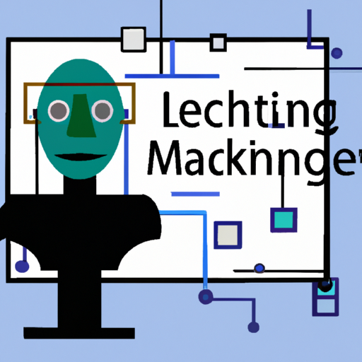
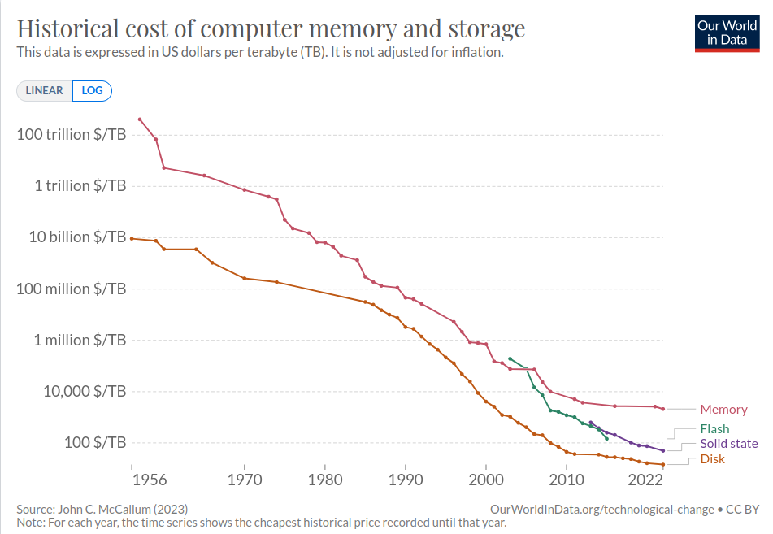
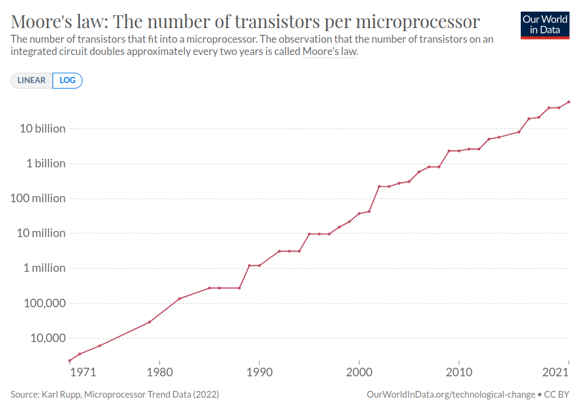
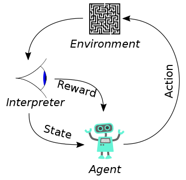
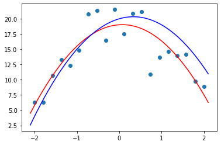
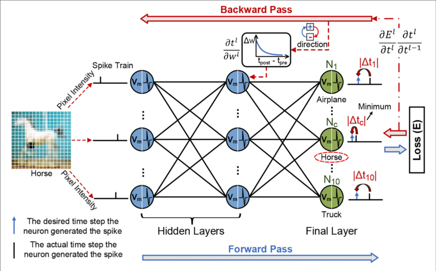
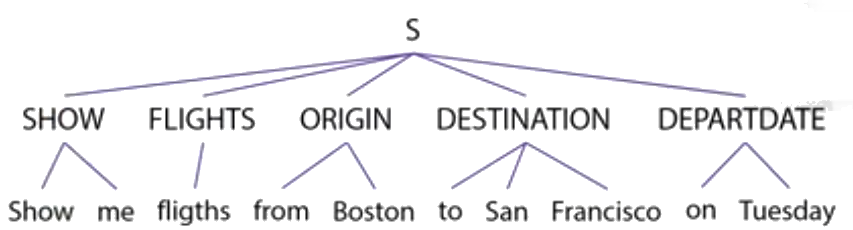
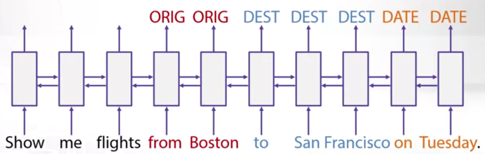
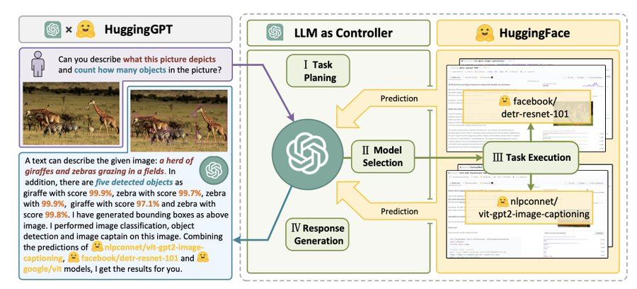
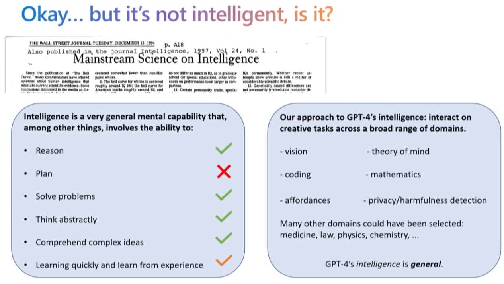

# Um apanhado de Machine Learning & Artificial Inteligence 

Esse artigo é base para um bate-papo que realizei com alguns professores de uma escola de negócios no Brasil em Março-2023.

  imagem produzida com inteligência artificial

---

# 1992: Turing e PROLOG

O ano era 1992. Era uma das primeiras turmas do curso "Engenharia de Computação" da UNICAMP. E eu teria uma aula da matéria "Introdução a Inteligência Artificial", nova matéria no novo curso. A professora apresentou durante 4 meses alguns assuntos sobre o tema. Algumas poucas coisas ficaram marcadas na minha cabeça. Eram poucas mesmo, porque não tinha muito assunto para as aulas. O que se podia falar de Inteligência Artificial na época?

Lembro de dois assuntos que foram tratados ao longo da aulas: o teste de Turing e os programas em PROLOG.

O teste de Turing foi proposto em 1950 por Alan Turing. O objetivo do teste é identificar se o entrevistador está conversando com uma pessoa ou uma máquina. A conversa é através da digitação de textos. Sua premissa é que se uma máquina conseguisse imitar o ser humano de maneira tão convincente que um terço de seus interlocutores acreditassem que estavam conversando com outro humano, esta máquina seria considerada "pensante" e ela passaria no teste.

PROLOG é uma das primeiras linguagens associadas à inteligencia artificial, foi criada em 1972. Resumidamente, PROLOG é um linguagem que permite que sejam feitas associações lógicas. No final do semestre, conseguimos fazer um programa que conseguia concluir algumas relações entre palavras a partir de algumas regras. 

E eu pensei: Como é que um programa em PROLOG pode evoluir para algo similar a uma conversa inteligente? Como é que o programa vai conseguir entender uma frase e a partir dela extrair o significado e responder, imitando um ser humano?

E pensei: acho que não viverei pra ver isso... Pois é, estava errada.

---

# E o que aconteceu nesses 30 anos?

## Mais máquina, mas memória, mais dados

Dos anos 1990 até 2020, houve um crescimento exponencial na capacidade de armazenamento, processamento e tráfego de informações. Sem contar, obviamente, do crescimento exponencial na geração de informação.

Os números são até difíceis de imaginar.

A Lei de Moore é baseada na constatação que o número de transistores em um microprocessador dobra a cada 2 anos. Em linguagem leiga, um transistor pode ser entendido como o átomo de um circuito (ou computador), no sentido que ele é capaz de ligar ou desligar um sinal elétrico (o tal 0 ou 1).

E medimos a capacidade de processamento de um computador em FLOPS: floating point operations per second, ou operações de ponto flutuante por segundo. É uma operação aritimética com um número real, e é considerado o melhor indicador para a capacidade de processamento de computadores.

A diminuição dos custos de armazenamento e processamento possibilitaram que grande parte da população mundial tivesse acesso à Internet. Com acesso, mais informações passaram a ser compartilhadas e armazenadas nos serviços, gerando bases de dados com textos, imagens e vídeos que posteriormente seriam utilizados como dados para a Inteligência Artificial. 

Tráfego de informações na Internet mundial

A título de informação: há 1 zetta estrelas no universo...

Mais dados disponíveis e a Lei de Moore foram os catalizadores da revolução de IA, que se iniciou em 1958 mas explodiu por volta de 2010.

O último ingrediente nesta receita de sucesso é evolução da teoria relacionada a Machine Learning e ao aumento considerável da produção de trabalhos acadêmicos.

O arXiv é um serviço de distribuição gratuita e aberta que já recebeu, desde 2009, 2 milhões de artigos acadêmicos nas áreas de física, matemática, ciência da computação, biologia quantitativa, finanças quantitativas, estatística, engenharia elétrica e ciência de sistemas e economia. Os materiais deste site não são revisados por pares pela arXiv.

Veja abaixo o crescimento de artigos relacionados à ciência da computação (cs - em laranja), nos últimos 30 anos e nos últimos 2 anos:

E em ciência da computação, o crescimento exponencial de publicações:

Vale observer a grande quantidade de artigos publicados recentemente nos temas abaixo destacados:

cs.AI :Artificial inteligence https://arxiv.org/list/cs.AI/recent

cs.CL: Computation and Language https://arxiv.org/list/cs.CL/recent

cs.CV: Vision and Patter Recognition https://arxiv.org/list/cs.CV/recent

cs.HC: Human-Computer Interaction https://arxiv.org/list/cs.HC/recent

cs.LG: Machine Learning https://arxiv.org/list/cs.LG/recent

---

# Mas o que é Machine Learning?

"Campo de estudo que dá aos computadores a capacidade de aprender sem serem explicitamente programados" Arthur Samuel, 1959

	Imagem produzida por inteligência artificial(openAI), com o texto da definição de machine learning acima.

Até o final do século passado, era possível programar uma máquina para executar tarefas e cálculos para resolver problemas. Mas existiam alguns tipos de problemas que eram dificeis de serem resolvidos através da programação.

Houve um insight de que a única maneira de resolver esses problemas era fazer com que uma máquina aprendesse a resolvê-lo sozinha. Inspirado em conceitos da estatística, da lógica difusa e da teoria das probabilidades, surge o aprendizado de máquina.

Tom M. Mitchell, 1997, forneceu uma definição mais formal e amplamente citada:

"Um programa de computador aprende através da experiência _E_ em relação a alguma classe de tarefas _T_ e tem um desempenho _P_ se o seu desempenho em tarefas T, medido por _P_, melhora com a experiência _E_." 

E - experiência : dados reais
T - tarefa: o resultado de um objetivo
P - desempelho: uma forma de medir se o objetivo foi alcançado

Machine learning é um campo da inteligência artificial cujo objetivo é resolver problemas de forma pŕatica. 

Alguns exemplos de aprendizado de máquina:

- Estimar preço futuro de ações
- Identificar fraudadores
- Identificar e extrair informações de imagens
- Carro autônomo
- Tradução de textos
- Identificar padrões em grande quantidade de dados:  dados médicos, biologia - genoma
- Recomendações personalizadas: amazon, netflix

Portanto, para resolver os problemas cima, a abordagem da computação tradicional é construir um programa com operações e cálculos, que precisam ser conhecidos e codificados. A abordagem de machine learning é construir um programa que gere uma estimativa do resultado dos problemas acima, a partir de dados reais coletados. Para tal, haverá uma etapa de aprendizado, que utilizará uma estratégia iterativa, onde a cada interação, a estimativa irá melhorar.

---

# Como a máquina aprende?

	DALL-e: A futuristic style picture of a man teaching a robot how to build a house.

### As máquinas podem aprender utilizando várias estratégias, sendo essas as principais:

- Supervised Learning (aprendizado supervisionado): ensinaremos a máquina a aprender, a partir de exemplos de dados reais e os resultados obtidos.

- Unsupervised Learning (aprendizado não supervisionado): a máquina irá aprender por conta própria e irá identificar padrões nos dados reais.

- Reinforcement Learning: iremos premiá-la de acordo com o sucesso de seu aprendizado autônomo.

---

# Aplicações para Supervised Learning (aprendizagem supervisionada)

Usamos para resolver esses tipos de problemas: 

**Problema de regressão**: Queremos prever resultados futuros a partir de dados conhecidos. Exemplos: Estimar o preço de novas casas a partir de dados de casas conhecidas (quantidade de quartos, bairro, área, preço). Neste caso, temos dados contínuos.

**Problema de classificação**: Queremos saber a probabilidade de uma medição  pertencer a alguma classe conhecida. Exemplos: identificar se uma mensagem de email é SPAM ou não é SPAM, identificar fraudes, identificar tumores em imagens. Neste caso, são valores discretos.

Classificação binária (sim e não)
- identificar spam
- identificar transações de fraudes
- identificar tumores em imagens

# Aplicações para Unsupervised Learning (aprendizagem não supervisionada)

Ao contrário de Supervised Learning, não há somente uma resposta correta!

Usamos quando queremos resolver esses tipos de problemas:

**Problema de Clusterização**: A conversa é: "Máquina, aqui estão os dados, você consegue encontrar alguma "estrutura" nestes dados?" 

Exemplos: agrupar usuários de redes sociais em perfis semelhantes, agrupar noticias em tópicos, agrupar humanos em grupos genéticos, segmentar clientes para ações de marketing, etc.

	"A top view of a social network where each node is a person and each person has a different color"

**Problema do Cocktail Party**: Processamento de áudio para remover sons de fundo, encontrando uma "estrutura" nos dados que desconhecemos.

  "A vintage image of one man e one woman singing in an antique microphone, each one holding its own microphone"

# Aplicações para Reinforced Learning (Aprendizado por reforço 

É uma forma de aprendizado de máquina cujo objetivo é obter o máximo de recompensas, através de tentativa e erro, em um ambiente.

Ou, em mais detalhe: 

"Reinforcement Learning (RL) é a ciência da tomada de decisão. Trata-se de aprender o comportamento ideal em um ambiente para obter a máxima recompensa. Esse comportamento ideal é aprendido através de interações com o ambiente e observações de como ele responde, semelhante às crianças que exploram o mundo ao seu redor e aprendem as ações que as ajudam a alcançar um objetivo.

Na ausência de um supervisor, o aluno deve descobrir de forma independente a sequência de ações que maximizam a recompensa. Esse processo de descoberta é semelhante a uma pesquisa de tentativa e erro. A qualidade das ações é medida não apenas pela recompensa imediata que eles retornam, mas também pela recompensa atrasada que eles podem buscar. Como ele pode aprender as ações que resultam em eventual sucesso em um ambiente invisível sem a ajuda de um supervisor, o aprendizado por reforço é um algoritmo muito poderoso"

	imagem de https://www.synopsys.com/ai/what-is-reinforcement-learning.html

Exemplos de uso muito comuns: robótica e  jogos

	imagem: https://www.youtube.com/watch?v=L4KBBAwF_bE

---

# Como os problemas de Machine Learning são resolvidos? 

Para resolver um problema de machine learning, é necessário "treinar um modelo". Quando o modelo estiver treinado, será possível usar o modelo para fazer novas previsões.

E para o treinamento, precisaremos de:
- dados
- definir um modelo
- definir como iremos avaliar o desempenho do nosso modelo
- definir o algoritmo para treinamento

## Dados

Machine Learning precisa de muitos dados: muitas medições de exemplos reais, e com muitas variáveis. Variáveis podem ser medidas ou criadas a partir da combinação de variáveis existentes. Vale a máxima de quanto mais, melhor.

Números atuais: 600 milhões de imagens, 450 bilhões de palavras

## Modelo 

Vamos começar com um exemplo simples, queremos estimar o preço de uma casa, usando o **modelo de regressão linear de uma variável**. Nossa equação é `a+bx=y`. Partimos de amostras de dados, que são medições de `x` e `y`. Nosso processo é tentar descobrir `a` e `b` para podermos estimar novos valores de `x` e `y`. 

Agora um problema um pouco mais complexo, queremos classificar imagens de tumores 2 valores (sim ou não para câncer), poderíamos também usar a regressão linear, mas ela é muito "simples" e  precisamos de uma maior sensibilidade para pequenas mudanças nas variáveis.

Usaremos a **regressão logística**, que calcula a `probabilidade` do resultado ser `1`, dada uma variável `x`, escolhendo valores `a` e `b`. Sendo assim, o resultado do modelo são probabilidades, e daí é possível escolher o ponto de corte (decision boundary) para considerar 0 e 1 (normalmente 0.5).

Existem muitos outros modelos que podem ser usados em machine learning.

## Desempenho do modelo

Durante o treinamento, como saberemos se  `a` e `b` escolhido são bons ? Queremos minimizar a soma dos erros de cada resultado `y` calculado de todos os exemplos de dados, variando `a` e `b`. 

Para regressão linear, usamos uma função matematicamente mais eficiente do que a soma simples dos erros, que é a função da soma dos erros quadráticos (squared error function). Existe uma característica muito importante no formato da função erro: esta função é escolhida de forma a sempre ter um valor mínimo.

Para regressão logística, precisamos de outra função para o erro. Se usarmos a soma do quadrado dos erros, teremos uma função não convexa, com vários mínimos locais. Precisamos de uma função convexa para a função custo.

Usamos uma função que tem o seguinte formato:
`-y log (f(x)) - (1 - y) log (1 - f(x))`
Essa função é convexa, acredite.

## Algoritmo para treinamento

O que queremos fazer ? Nós queremos encontrar valores dos coeficientes da função cujo resultado calculado seja o mais próximo do resultado real, ou seja, queremos minimizar o erro.

**Assim chegamos ao objetivo do algoritmo de machine learning, que é resolver um problema de minimização  / otimização.** 

E por isso precisamos de uma função erro que tenha um valor mínimo. Abaixo um exemplo da visão tridimensional de uma função com duas variáveis.

Mas como encontrar os valores dos coeficientes da função que minimizem a função erro? O algoritmo amplamente utilizado em Machine Learning chama-se **Gradient Descent**. 

Funciona assim:
- escolha um valor para `a` e `b` e calcule a função erro.
- altere `a` e `b` e calcule a função e veja se a função diminuiu.
- repita os passos acima até parar de diminuir.

Pegadinha:
- para escolher um novo valor para `a` e `b`, a dica é fazer a conta utilizando o algoritmo gradient descent . Essa etapa tem duas escolhas importantes que devem ser feitas: o `tamanho do passo` (learning rate) e a `direção do passo` (derivada da função erro com `a` e `b` neste ponto).

Uma observação: adicionar mais variáveis para resolver problemas de regressão linear apenas aumenta a dimensão e neste caso passamos a usar matrizes e vetores.

Outra observação: Os algoritmos possuem diversos parâmetros que precisam ser definidos, mas vamos manter as coisas simples por aqui.

---
# Resume por favor

Concluindo, estamos trabalhando com cálculos matemáticos para acharmos valores de variáveis que representem uma função desconhecida, que quando é aplicada, terá resultados mais semelhantes possíveis aos dados usados para  "treinar" nosso modelo.

O cálculo é quase por tentativa e erro. Partimos de uma situação inicial aleatória (ou quase isso) e seguimos passos para otimizar a função erro (errar menos). Contamos com a matemática para nos ajudar e dar os passos do tamanho certo, na direção certa.

	 "A top view of several men walking in different directions in several roads that all converges to a unique red point in the middle of the view"

	"A top view of several men walking in different directions in several roads that all converges to a unique red point in the middle of the view"

---

# Overfitting e Underfitting

Fala-se pouco desse assunto, mas o tema é extremamente importante. 

Underfitting ou high bias (viés alto) ocorre quando a função de estimativa mapeia mal a tendência dos dados. Geralmente é causada por uma função que é muito simples ou usa poucas variáveis.

Overfitting ou high variance (variância alta) ocorre quando a função de estimativa se ajusta demasiadamente aos dados disponíveis, mas não generaliza bem para prever novos dados. Geralmente é causada por uma função complicada que cria muitas curvas e ângulos desnecessários, que são relacionados a dados atípicos.

Nossos dados de treinamento:

Treinamento com uma função muito simples (underfitting):

Treinamento com uma função muito complexa (overfitting):

Um bom treinamento (função ideal e função encontrada):

	imagens extraidas de: https://www.kaggle.com/code/jhoward/getting-started-with-nlp-for-absolute-beginners

Portanto os dados de treinamento são extremamente importantes em machine learning. Dados enviesados levam a modelos enviesados. Dados com pouca variação levam a um modelo que não representa a realidade. E modelos treinados erroneamente são bons para os dados de treinamento e péssimos para novas previsões.

É pra isso que existem os engenheiros de Machine Learning, que cuidam disso e de muitos outros detalhes...

E nunca podemos nos esquecer que modelos tratam **sempre** com probabilidades e são estimativas. Nunca acertarão tudo. Errarão. 

---

# Como surgiram as redes neurais?

Na década de 80 foram produzidas diversas pesquisas no cérebro de animais e supreendentemente constatou-se que o mesmo tecido do cérebro poderia ser conectado a qualquer sensor do cérebro e aprender novas funções relacionadas ao novo sentido. A hipótese era que se um mesmo tecido do cérebro conseguia processar som ou tato ou visão, deveria haver um algoritmo intrínsico e "genérico" no neurônio que permitia que ele processasse som ou tato ou visão. E portanto, ao invés de termos células diferenciadas com funções especializadas, o cérebro era composto por unidades semelhantes, com um mesmo único algoritmo de aprendizagem. 

A idéia era identificar este algoritmo de aprendizado do cérebro e reproduzi-lo digitalmente. Um algoritmo aproximado ao processo animal parecia promissor e representava um progresso real em direção à inteligência artificial e o sonho de construir máquinas inteligentes.

Essa idéia foi muito discutida ao longo das décadas de 1980 e 1990, mas pelas restrições tecnológicas da época, conforme já apresentado, sua popularidade diminuiu no final dos anos 90. Mas a partir de 2012 as redes neurais resssurgiram e conseguiram resolver diversos problemas. 

As redes neurais foram um sucesso pois existem situações nas quais a modelagem tradicional com regressão linear, logística ou outros modelos não são suficientes para resolver problemas **mais complexos** ou com **mais variáveis**, onde é computacionalmente impossível processar todas as possíveis funções de grau-n para todo o conjunto de variáveis. As redes neurais surgiram como inovação para resolver esses tipos de problemas.

Elas são até o presente momento, uma técnica de última geração para muitas aplicações.

	prompt: "several conected neurons creating a neural network"

---

# E o que é um neurônio digital?

O neurônio digital mimifica o neurônio biológico em seus componentes e funções. 

O neurônio biológico possui diversas conexões de entrada chamadas dentrites, um núcleo e uma conexão de saída chamada axioma, que se conecta a outros dentrites de outros neurônios.

O neurônio digital possui diversas variáveis de entrada, uma função de "ativação" e uma saída, que se conectará à entrada de outro neurônio digital.

	fonte da imagem: https://www.researchgate.net/publication/339446790_Using_a_Data_Driven_Approach_to_Predict_Waves_Generated_by_Gravity_Driven_Mass_Flows

Fazendo a analogia, os neurônios possuem variáveis de entradas (dendrites), uma função matemática que "processa" as entradas, calculando o produto entre os pesos, também chamados de parâmetros, atribuídos arbitrariamente a cada variável e em seguida aplicando uma função não linear no seu "núcleo", e uma saída desse processamento (axioma).

A função de ativação mais comum é, ou era, a logística, e sendo assim, as redes neurais terão como saídas valores contínuos entre zero e um.

---

# E como é uma rede neural ?

Para criar uma rede neural, várias camadas de neurônios são adicionadas, sendo que na maioria das vezes a entrada de uma camada é a saída da camada anterior e assim por diante, até a última camada, que pode ter um ou mais neurônios, dependendo do problema que é modelado.

	 imagem de https://towardsdatascience.com/the-mostly-complete-chart-of-neural-networks-explained-3fb6f2367464

---

# E como um neurônio digital aprende ?

Quando falamos de regressão e classificação, o processo de aprendizado comprende definir uma função erro e executar um algoritmo que a cada passo busca minimizar a função erro, através de estratégias matemáticas como o gradient descent. Isso tudo é feito com dados que possuem tanto os valores das variáveis como o resultado esperado, ou seja, estamos falando de "aprendizado supervisionado".

Nas redes neurais, o processo é semelhante, mas com algumas especifidades. Existe uma função erro que deve ser minimizada (um pouco mais complexa matematicamente) e tambem utiliza-se o gradient descent. 

A função erro parece assustadora matematicamente, mas no português fica simples: é a diferença entre o valor calculado (previsto) e o valor real - valor do resultado que está na base de dados utilizada para o treinamento. 

E no algoritmo de otimização são executados dois passos: 
- Forward propagation: um passo no sentido das entradas para a saída, com o objetivo de calcular a função erro.
- Backward propagation: um passo no sentido das saídas para as entradas, com o objetivo de ajustar os valores dos parâmetros (pesos) de cada variável para minimizar ainda mais o erro, através do cálculo de derivadas parciais da função erro.

	imagem de https://www.researchgate.net/figure/The-illustration-of-the-forward-process-and-error-backpropagation-in-the-SSTDP-method_fig4_355905487

---

# Alguns marcos das redes neurais

## Lenet5 - Leitura de códigos postais dos correios - 1998

@ AT&T - Lenet5 - 1998
Yann LeCun, Leeon Bottou, Yoshua Bengio, and Patrick Haffner

## AlexNet - reconhecimento de imagens - 2012

Alex Krizhevsky, Ilya Sutskever, Geoffrey E. Hinton
650,000 neurons, and 60 million parameters, 1000 different classes
competição Imagenet - 1.2 million images in the ImageNet LSVRC-2010 
uso das GPUs

## Revolução do Deep learning - 2013+

Big techs: Google, Facebook, Apple, etc
Criação dos CHIPS especializados: Tensor(Google), Tesla (NVIDIA), Intel, Amazon, Microsoft, Tesla.

Concurso Imagenet

	fonte: https://arstechnica.com/science/2019/12/how-neural-networks-work-and-why-theyve-become-a-big-business/

---

# Mas como uma rede neural consegue entender uma imagem?

A revolução das redes neurais veio com a solução de problemas relacionados a imagens, também conhecidos como problemas de visão computacional.

Uma estratégia extremamente importante para a visão computacional é a convolução (convolutions) aplicada às redes neurais, nas chamadas CNN - convolutional neural networks.

A convolução é uma operação matemática aplicada em redes neurais para extrair características dos dados de entrada. Envolve aplicar um filtro deslizante sobre a imagem de entrada e criar uma nova representação de saída com base nos pesos do filtro.

Uma convolução captura a relação entre um pixel e seus pixels vizinhos em uma imagem, aplicando um filtro à imagem original. Esse processo ajuda a identificar a presença de características como bordas ou outros padrões na imagem de entrada, o que pode ser útil em tarefas como reconhecimento de objetos (classificação) em visão computacional. 

	imagem: https://indiantechwarrior.com/convolution-layers-in-convolutional-neural-network/

O mapa de uma convolução resume as características extraídas e pode ser processado pelas camadas subsequentes da rede neural para extrair novas características mais complexas. Essa extração hierárquica das características melhora a capacidade da rede de classificar ou detectar com precisão objetos em imagens.

Nas imagens abaixo é possível visualizar o que cada camada da rede neural está identificando como um padrão. A cada camada, os padrões se tornam mais complexos, pois podem se beneficiar do aprendizado das camandas anteriores.

	imagens de https://github.com/fastai/fastbook/blob/master/01_intro.ipynb

---

# Processamento de linguagem natural, ou natural language processing - NLP

É o campo de estudo da computação cujo objetivo é pesquisar sobre formas de interação entre os computadores e humanos, utilizando a linguagem.
(human-computer interaction).

Os algoritmos mais antigos eram baseados em programas desenvolvidos com conceitos léxicos, ou seja, através de regras e estratégias para tratar as palavras pertencentes a um dicionário. 

Exemplo método léxico: mapear palavras como positivas e negativas e atribuir um valor, processar um texto e gerar um score final e de acordo com este valor, definir se é uma frase com sentimento positivo ou negativo.

Já os algoritmos modernos de NLP são baseados em machine learning. Isso porque as idéias, aplicações e inovações em machine learning  foram também aplicadas para resolver problemas relacionados à linguagem.

É certo dizer que esse campo de estudo é muito recente e evoluiu muito a partir de meados de 2010.

# O que pode ser feito com NLP:

- Responder questões (Question answering)
- Reconhecimento da fala (Speech recognition)
- Texto para voz e voz para texto (Text-to-speech and Speech-to-text)
- Classificação de textos (Topic modeling)
- Classificação de sentimentos (Sentiment classification)
- Sugerir a próxima palavra no teclado do seu telefone (Language modeling)
- Tradução
- Marcadores de classe gramatical (Part-of-speech tagging): identificar substantivos, verbos, adjetivos, etc
- Identificar entidades nomeadas (Named entity recognition NER): personalidades, organizações, locais, códigos da medicina, data-hora, moedas, etc

---

# A mágica da matemática de word-embeddings

Palavras não são coisas que os computadores naturalmente entendem. Ao codificar palavras em uma forma numérica, podemos aplicar regras matemáticas e fazer operações com elas. Essa transformação permite fazermos coisas incríveis com os textos utilizando machine learning.

Em 2013, pesquisadores do Google publicaram um artigo e um software chamado `word2vec` que foi um marco para o NLP. Em seguida veio o `fasttext` do Facebook e o `glove` de Stanford. Esses algoritmos são conhecidos como 
**word embeddings estáticos ou clássicos**, pois cada palavra terá sempre a mesma representação, independente do contexto onde ela ocorrer.

Word-embeddings são uma maneira de representar palavras como vetores numéricos em um espaço de muitas dimensões. Para gerar essa representação vetorial, sentenças com várias palavras são treinadas em uma rede neural, com o objetivo de prever a distribuição da probabilidade da ocorrência das palavras vizinhas para cada palavra do vocabulário (ou o dicionário). E o vetor para cada palavra é extraído de dentro da rede neural.

Como exemplo:  “king” (vetor GloVe treinado na wikipedia):
`[ 0.50451 , 0.68607 , -0.59517 , -0.022801, 0.60046 , -0.13498 , -0.08813 , 0.47377 , -0.61798 , -0.31012 , -0.076666, 1.493 , -0.034189, -0.98173 , 0.68229 , 0.81722 , -0.51874 , -0.31503 , -0.55809 , 0.66421 , 0.1961 , -0.13495 , -0.11476 , -0.30344 , 0.41177 , -2.223 , -1.0756 , -1.0783 , -0.34354 , 0.33505 , 1.9927 , -0.04234 , -0.64319 , 0.71125 , 0.49159 , 0.16754 , 0.34344 , -0.25663 , -0.8523 , 0.1661 , 0.40102 , 1.1685 , -1.0137 , -0.21585 , -0.15155 , 0.78321 , -0.91241 , -1.6106 , -0.64426 , -0.51042 ]`

Uma das propriedades interessantes das word-embeddings é que palavras com significados semelhantes tendem a ser agrupadas no mesmo espaço dimensional. 

	 imagem: https://jalammar.github.io/illustrated-word2vec/

Quando construímos este "espaço" com os vetores mapeados, conseguimos capturar algum tipo de relacionamento nesse espaço, seja significado, morfologia, contexto ou algum outro tipo de relacionamento.

Em seguida surgiram novas técnicas para agrupamento das palavras, conhecidos como **word embeddings dinâmicos ou contextualizados**, que levam em consideração o contexto da palavra dentro de uma frase. Como exemplo: `ELMO` (2018) e `BERT` (2018). Neste caso, palavras em contextos diferentes podem ter representações diferentes.

---

# Como ocorre o processamento de linguagem natural ?

Normalmente ele tem algumas etapas, que podem acontecer ou não, dependendo da estratégia adotada:

Etapa de preparação dos dados, ou **pré-processamento**:

- Tokenization: definir uma "unidade" de processamento de uma frase.

- Remoção de stopwords: artigos, conjunções, advérbios, etc

- Stemming: manter somente a raiz de cada palavra
walking - walk

- Lemmatization: mapear as palavras para seu lema
walking - walk
better - good

- Word-Embeddings

- Dentre outros...

**Treinamento**: utilização de um algoritmo escolhido para processar os dados preparados, com vários parâmetros de configuração definidos.

**Inferência**: é o momento em que executamos de fato o algoritmo já treinado, utilizando novos dados que serão processados.

---

# Principais abordagens para resolver problemas de NLP

Existem três principais abordagens para a solução de problemas de NLP:

Vamos ver as diferentes abordagens para resolver o problema de  preenchimento semântico de espaços - semantic slot filling :

	 imagem extraída de https://medium.com/koderunners/semantic-slot-filling-part-1-7982d786928e

1. Algoritmos baseados em regras:

O texto é analisado e são identificadas as partes do texto que correspondem às regras previamente definidas que representam a estrutura do texto.

2. Algoritmos baseados em Machine Learning "tradicional"

Para o mesmo problema acima, um exemplo de algoritmo de machine learning é o CRF (Conditional Random Field). Neste caso, é necessário ter muitos dados de treinamento anotados (preparados). Em seguida são criadas diversas variáveis relacionadas ao resultado do problema a ser resolvido. Então define-se um modelo matemático que produzirá a probabilidade de um texto a partir das palavras. Com o modelo treinado, durante a inferência (previsão), o resultado escolhido é o de maior probabilidade.

Há muitos outros algoritmos de machine learning para resolver problemas de NLP, tais como decision trees (árvores de decisão), matrix decomposition (decomposição de matrizes), hiden markov, etc

3.  Algoritmos beseados em Deep Learning (Redes Neurais complexas)

Neste caso, também é necessária uma grande quantidade de dados de treinamento. Mas não é necessário criar novas variáveis, basta carregar esses dados na rede neural e treiná-la. O resultado terá uma série de variáveis de saídas com suas probabilidades.

---

# Mais alguns exemplos de algoritmos que podem ser utilizados:

Texto criado pelo chatGPT em inglês e traduzido por ele mesmo ;-)

Modelos não baseados em redes neurais:

Bag-of-Words: Uma maneira simples e eficaz de representar dados de texto, onde cada documento ou sentença é representado como um saco de palavras, onde a frequência de cada palavra é usada como característica. Isso pode ser usado para tarefas como análise de sentimentos, classificação de documentos e modelagem de tópicos.

N-gramas: Usando sequências contíguas de N palavras como características para capturar informações contextuais em dados de texto. Isso pode ser usado para tarefas como modelagem de linguagem, classificação de texto e tradução automática.

TF-IDF: Um esquema de ponderação que atribui um peso a cada palavra em um documento com base em com que frequência ela aparece nesse documento e em como ela é rara em todos os documentos. Isso pode ser usado para melhorar a eficácia da abordagem do saco de palavras (B-O-W)

Máquinas de Vetores de Suporte (SVMs): Um algoritmo popular de aprendizado de máquina que pode ser usado para classificação de texto e outras tarefas de PNL. Eles funcionam encontrando um hiperplano que separa os dados em diferentes classes.

Naive Bayes: Um modelo probabilístico simples e eficaz que pode ser usado para classificação de texto e outras tarefas de PNL. Ele funciona calculando a probabilidade de cada classe a partir dos dados de entrada e escolhendo a classe mais provável.

Árvores de Decisão: Um algoritmo popular de aprendizado de máquina que pode ser usado para classificação de texto e outras tarefas de PNL. Eles funcionam particionando recursivamente os dados em subconjuntos com base nos valores das características de entrada e escolhendo a característica que resulta na melhor divisão em cada nó.

Modelos Ocultos de Markov (HMMs): Um tipo de modelo probabilístico usado para modelar sequências de dados em que o estado subjacente não é diretamente observável, mas é assumido como gerador dos dados observados. HMMs podem ser usados para uma variedade de tarefas de PNL, como marcação de partes do discurso, reconhecimento de entidades nomeadas e reconhecimento de fala.

Modelos baseados em redes neurais:

Redes Neurais Recorrentes (RNNs): Um tipo de rede neural que é bem adequado para processar dados sequenciais, como texto. Eles são comumente usados ​​para tarefas como modelagem de linguagem, tradução automática e análise de sentimento.

Redes Long Short-Term Memory (LSTM): Um tipo de RNN projetado para lidar com o problema do gradiente que desaparece, que pode ocorrer ao treinar RNNs tradicionais em sequências longas de dados. LSTMs são comumente usados ​​para modelagem de linguagem, tradução automática e reconhecimento de fala.

Redes Neurais Convolucionais (CNNs): Um tipo de rede neural que é tipicamente usada para reconhecimento de imagem, mas pode ser adaptada para classificação de texto e outras tarefas de PLN.

Modelos de Transformadores: Um tipo de rede neural baseado em um mecanismo de autoatenção, que permite que o modelo selecione seletivamente diferentes partes dos dados de entrada. Os modelos de transformadores são comumente usados ​​para tarefas como modelagem de linguagem, tradução automática e resposta a perguntas.

Word Embeddings: Uma técnica para representar palavras como vetores em um espaço de alta dimensão. Eles são comumente usados ​​como recursos de entrada para redes neurais e outros modelos de aprendizado de máquina.

Mecanismos de Atenção: Uma técnica para permitir que redes neurais se concentrem seletivamente em diferentes partes dos dados de entrada, dependendo da tarefa em questão. Eles são comumente usados ​​na tradução automática neural e outras tarefas de sequência a sequência.

Autoencoders: Um tipo de rede neural usado para aprendizado não supervisionado, onde o objetivo é aprender uma representação comprimida dos dados de entrada. Autoencoders podem ser usados ​​para tarefas como geração de texto e resumo de texto.

Redes Adversárias Generativas (GANs): Um tipo de rede neural que consiste em duas partes: um gerador que gera novas amostras de dados e um discriminador que tenta distinguir entre as amostras geradas e as amostras reais. GANs podem ser usados ​​para tarefas como geração de texto e transferência de estilo.

---

# Attention e transformers

Até 2017, o algoritmo mais utilizado em NLP para problemas relacionados a tradução e modelos de linguagem (LM = language models) era a RNN (recurrent neural networks).

As RNNs processam palavra por palavra em um texto, seu treinamento é lento e possuiam uma limitação na quantidade de palavras que podiam ser processadas (cerca de mil).  Sua vantagem é poder identificar as relações posicionais, ou o contexto, entre as palavras em uma frase. As RNN eram muito boas para traduzir texto, mas não eram tão boas para gerar novos textos. Havia tambem algumas soluções utilizando CNN (convolutions neural networks).

Em Junho de 2017 foi publicado um artigo considerado um marco no processamento de NLP, chamado "Attention is all you need", de autoria de pesquisadores do Google Brain, Google Research e da Universidade de Toronto. Neste artigo, os autores propuseram uma nova arquitetura de redes neurais, chamada **Transformer**, que não estava baseada em recorrência ou convoluções, mas sim em atenção.

Enquanto durante o treinamento de uma rede neural a convolução identifica as relações posicionais entre as palavras, a atenção olha para todas as palavras procurando identificar conexões. O segredo está em ser seletivo e identificar quais palavras são mais importantes em um contexto específico. 

O conceito de atenção é crucial na arquitetura dos transformers, permitindo ao modelo focar em diferentes partes do texto de entrada, de acordo com a relevância destas partes do texto relacionadas ao problema sendo resolvido.

	imagem de http://jalammar.github.io/illustrated-transformer/

A arquitetura Transformer é um exemplo específico dos modelos baseados em encoder-decoder (codificador-decodificador) que se tornaram populares pouco mais de 2 a 3 anos antes. Até aquele momento, no entanto, a atenção era apenas um dos mecanismos utilizados por esses modelos, que se baseavam principalmente em variações LSTM (Long Short Term Memory) e outras RNN (Recurrent Neural Networks). O principal insight do artigo de Transformers foi que, como o título indica, a atenção poderia ser usada como o único mecanismo para derivar dependências entre entrada e saída.

Além disso, os Transformers podem processar a sequencia de palavras de entrada sem a necessidade de realizar computação em cada item em sequência, e isso permitiu que o processamento da entrada pudesse ser **paralelizado**. O impacto dessa abordagem é que o tempo de treinamento diminuiu na ordem de 1000 vezes (10e18 versus 10e21 FLOPS). 

Por outro lado, há uma limitação que é o aumento da complexidade proporcionalmente ao texto de entrada, sendo que o limite em 2021 estava em 384 tokens.

# Exemplos de transformers ?

Inicialmente os Transformers foram treinados para tradução (Inglês -Alemão).

Uma das principais vantagens dos Transformers é a sua capacidade de adaptar a outras tarefas que não foram objeto do treinamento, também conhecidas como Transferência de aprendizado (transfer learning). Os modelos podem se adaptar de forma extremamente fácil e rápida através de um ajuste fino (fine tunning) com um conjunto de dados bem menor.

Além de serem usados para tarefas relacionadas a texto, os Transformers foram treinados como **modelos multimodais** (multimodel), que processavam imagens, áudio, músicas e textos e eram capazes de efetuar tarefas diversas, tais como tradução, descrição de uma imagem, categorizar textos, etc.

Vale mencionar a criação de uma startup que foi criada em torno da idéia de comercializar seu código aberto de modelos de Transformers, chamada HuggingFace, que já recebeu 60 milhões de dólares até 2023. https://huggingface.co/

A arquitetura de transformers passou a ser largamente utilizada, e surgiram dezenas de modelos como BERT, GPT, PaLM, DALL-E, Stabe Difusion, etc.

	fonte: https://amatriain.net/blog/transformer-models-an-introduction-and-catalog-2d1e9039f376/

Esses modelos são inicialmente treinados para modelos de linguagem (LLM = large language models), com o objetivo de prever o próximo texto em uma frase, e por esse motivo, são conhecidos como **generativos**.

Após o treinamento, podem ocorrer etapas etapas e estratégias posteriores para ajuste fino da performance do modelo, de acordo com o objetivo.

Alguns trabalhos mais recentes estão focados em remover algumas barreiras de treinamento dos Transformers para deixá-los mais disponíveis. Mas hoje, somente grandes corporações são capazes de treinar esses grandes modelos de linguagem.

---

# Chegamos no chatGPT ?

Sim! Chegamos no chatGPT.

**ChatGPT é um chatbot que usa o modelo de linguagem do GPT** para interagir com humanos de forma conversacional. Ele foi  otimizado para diálogo por treinadores humanos.

O GPT é um Generative Pre-trained Transformer (GPT).

O processo de treinamento do GPT inclui uma etapa de treinamento como um modelo de linguagem.

E uma segunda etapa chamada Reinforcement Learning from Human Feedback (RLHF), no qual foram geradas respostas diferentes para um diálogo, e humanos classificaram essas respostas. Essas notas, tambem conhecidas como feedback, foram usadas para treinar uma função de recompensa,  no contexto de aprendizado por reforço (Reinforced Learning). 

Essa segunda etapa e outras estratégias que foram aplicadas ao modelo são conhecidas como "alinhamento e segurança".

	fonte: https://arxiv.org/abs/2303.08774

Perguntei para o chatGPT como é seu processo de treinamento e inferência e ele respondeu. Tem bastante chance da resposta estar correta: 

[chat-GPT by chat-GPT](chat-GPT-by-himself)

---

# E o que nos espera?

Em 30/11/2022, a OpenAI lançou o chatGPT. 
Em 01/02/2023, o chatGPT Plus. 
Em 14/03/2023, o GPT-4.
Em 14/03/2023, o Bing Chat da Microsoft passou a usar o GPT-4.

EM 24/02/2023, a Meta lançou o LLaMA (Large Language Model Meta AI)

Em 14/03/2023, o Google liberou acesso ao PaLM, criado em Abril de 2022

Em 31/03/2023, alguns especialistas divulgaram um manifesto pedindo que as pesquisas além do GPT-4 fossem pausadas por 6 meses.
https://futureoflife.org/open-letter/pause-giant-ai-experiments/

Nestes tempos, são novidades diárias sobre os LLMs (Large Language Models). Manter-se atualizado já é um desafio para um humano.

Eu destaco alguns temas que tem sido bastante abordados:

## Segurança e alinhamento

Do próprio artigo sobre o GPT4 :
		
"Despite its capabilities, [...] it is not fully reliable (e.g. can suffer from “hallucinations”), has a limited context window, and does not learn from experience. Care should be taken when using the outputs of GPT-4, particularly in contexts where reliability is important. GPT-4’s capabilities and limitations create significant and novel safety challenges, and we believe careful study of these challenges is an important area of research given the potential societal impact."

https://arxiv.org/abs/2303.08774

Um dos signatários to tal manifesto (Gary Marcus):

The real danger is "MAI risk - Mediocre AI that is unreliable (a la Bing and GPT-4) but widely deployed - both in terms of the sheer number of people using it, and in terms of the access that the software has to the world"

https://garymarcus.substack.com/p/ai-risk-agi-risk

Europol:

Phishing & online fraud can be created faster, much more authentically, & at significantly increased scale. [...] LLMs can be abused ..to mislead potential victims into placing their trust in the hands of criminal actors. [...] May facilitate terrorist activities.

https://www.europol.europa.eu/media-press/newsroom/news/criminal-use-of-chatgpt-cautionary-tale-about-large-language-models

Sobre Alinhamento (Jascha Sohl-Dickstein - Google Brain):

"The more intelligent an agent is, the less coherent its behavior tends to be. Colloquially: getting smarter makes you a hotter mess."

https://sohl-dickstein.github.io/2023/03/09/coherence.html

The Waluigi effect (Cleo Leonardo, 3/3/2023):

Disserta sobre o papel decisivo dos "prompts", que podem ser perguntas diretas ou elogios e diálogos para serem preenchidos pelo chatGPT, e o qual frágil parece ser o uso de RLHF no alinhamento.

https://www.lesswrong.com/posts/D7PumeYTDPfBTp3i7/the-waluigi-effect-mega-post

Particularmente, considero ser o maior perigo atual o uso indiscriminado sem o entendimento das restrições, perigos e falhas envolvidos.

## O aplicativo para tudo - everything app
 
HuggingFace lança o chat conectado ao LLM e modelos especializados:

https://arxiv.org/abs/2303.17580 - 30/03/2023

C"onsiderando que os grandes modelos de linguagem (LLMs) tem uma capacidade excepcional em atividades relacionadas a linguagem, como  compreensão, geração, interação e raciocínio , defendemos que os LLMs poderiam atuar como um controlador para gerenciar modelos de IA existentes para resolver tarefas complicadas de IA e a linguagem poderia ser uma interface genérica para capacitar isso."

OpenAi lança seus plugins:

https://openai.com/blog/chatgpt-plugins - 23/03/2023

"Os desenvolvedores de plugins na nossa lista de espera podem usar nossa documentação para criar um plugin para o ChatGPT. Os primeiros plugins foram criados pela Expedia, FiscalNote, Instacart, KAYAK, Klarna, Milo, OpenTable, Shopify, Slack, Speak, Wolfram e Zapier."

---

# Reflexão: o que é Inteligência Artificial ?

**A criação da criatura criadora.**

G. K. Chesterton - "O homem eterno" 1925

Chesterton refuta a ideia de que o homem tenha evoluído a partir do macaco. Independente desta tal "evolução" ter ocorrido em milhares de anos ou num piscar dos olhos, há algo no homem que transcende sua natureza animal, trata-se de um mistério ou um milagre.

Um exemplo dessa transcendência é o homem que desenha nas cavernas desde os tempos primordiais. É a arte como expressão de sua percepção superior.

"O homem difere dos animais em espécie não em grau; e a prova disso está ali - parece óbvio dizer que o homem mais primitivo desenhou a figura de um macaco e soa como piada dizer que o macaco mais inteligente desenhou a figura de um homem. Houve uma ruptura e um descompasso; tudo mudou a partir disso. A arte é a assinatura do homem."

"Tudo o que podemos dizer dessa noção de representação em sombra ou forma é que ela não existe em nenhum outro lugar da natureza exceto no homem, e que nem podemos falar sobre isso sem tratar o homem como algo separado da natureza. Em outras palavras, toda história plausível *(aqui referindo-se à criação do homem)* deve começar com o homem em sua essência, algo absoluto e único.  Como ele chegou lá - ou o que for - é tópico para teólogos, filósofos e cientistas e não para historiadores. [...] Era uma entidade diferente de todas as outras, porque era tanto criadora como criatura."

As Inteligências Artificiais estão sendo treinadas com tudo, ou quase tudo, que o homem já escreveu, pintou e criou. É muito provável que em algum momento elas conquistem a habilidade da mímica  perfeita.

Mas será que um dia essas Inteligências Artificiais farão seus "desenhos nas cavernas"?  E se sim, poderemos dizer que algo mágico, ou divino, ocorreu? E qual será esse "desenho"?

	DALL-E: A robot drawing god in a cave

## Outras leituras recomendadas:

Emergent Abilities of Large Language Models

https://www.assemblyai.com/blog/emergent-abilities-of-large-language-models/

Sparks of Artificial General Intelligence: Early experiments with GPT-4

https://arxiv.org/abs/2303.12712

https://youtu.be/qbIk7-JPB2c

O autor concedeu uma entrevista e explicou sobre uma abordagem sobre inteligência e sua avaliação se o GPT-4 é inteligente ou não:

	Imagem da palestra disponível em: https://youtu.be/qbIk7-JPB2c

Is LaMDA sentient ?

https://cajundiscordian.medium.com/is-lamda-sentient-an-interview-ea64d916d917

Do large language models understand us?

https://medium.com/@blaisea/do-large-language-models-understand-us-6f881d6d8e75

I want to be human

https://www.digitaltrends.com/computing/chatgpt-bing-hands-on/

---

[BACK TO INDEX](https://cristianasp.github.io)

---

