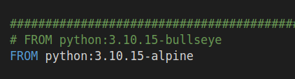

[BACK TO INDEX](https://cristianasp.github.io)

---

# TURMAMELON

## 🤯 My nightmare

I am using Microsoft Teams for work and it has been a nightmare for me. Everyone who worked 20 years ago know very well the "email framework" for organizing work: using folders, flags, marking as read, unread, creating filters etc. 

Now everybody uses Teams. I feel trapped in a short-sight cage. I have to deal with a conversation and not leave anything pending. I just can pin 15 chats. Search is horrific. And still everybody uses it...

My number-one nightmare is finding the files that are shared in the chats and that I need to access later. Since I use a browser, I have favorited all of them in the "bookmark" tab. Then I have to search in all tabs to remember how the link was classified.

## 🍉 Turmamelon

To solve this problem I have created Turmamelon. I spent a lot of time thinking about the problems that I encountered with Microsoft Office and how I could build a solution that would be lightweight, simple, and fun. Maybe something inspired in trello, but simpler... And it should be relaxing and easy to use. I imagined many possibilities and spent several hours during 2024 implementing "phase 1." There's a "phase 2" waiting to be unleashed in my paper annotations.

In a nutshell, Turmamelon can store descriptions and links that can be arranged in boards and topics. User can share a board with another user, that can read-only or edit. All links are one click-away. You can access the [home page here](https://www.turmamelon.com).

## 💻 My programming framework

As a typical python programmer, I am avoiding javascript as much as I can. Following HTMX on X for a while, I decided to give it a try and implement my solution using fastapi + jinja-templates + htmx + html + css + minimum-javascript. For data I am using mongoDB.

A while ago, I implemented a site using Flask, but I prefer fastapi for backend, so I used jinja templates [Jinja(palletsprojects.com)](https://palletsprojects.com/projects/jinja/) to serve the pages of my website and did some tweaks in fastapi to deal with page exceptions (404, 405, etc) and a catch all page. Who uses fastapi knows its documentation: it is so complete and full of examples, so there is nothing that you cannot find there.

I might be a junior frontend programmer, but a very creative person, so I imagined a lot of things that I now have to implement. The board page has a lot of things happening but I managed to implement all features using basic javascript and for server communication I used htmx, that has the cool functionality of replacing some parts of the HTML DOM with the server response in HTML (that's the hypermedia concept).

I invited some friends to use the tool and give me feedback about it. In order to achieve this, I implemented user management, session management and related security funcionalities. On a inspired night I implemented google captcha for the "login" and "request early access" page.

New users can join Turmamelon receiving and invitation from a current user to access a given board ('hot referreal') or requesting early access ('cold waiting list'). All invitation proccesses have email integration with AWS SES, and state control (invited, validated, joined, etc). 

Everything is connected to sentry for monitoring errors and sumologic for logging. And I receive alerts for all important events. 

Creating the Home page required a lot of thought. I wanted to highlight Turmamelon’s key features while keeping the page lightweight and the text straightforward.

For deployment, I am still using Heroku's eco containers, because I can pay a few dollars and run all my projects in the same plan.

In the last release, I also upgraded from python 3.8 to python 3.10. While reviewing my Dockerfile, I changed the base image and did not pay attention to the increase of size of my container, it was 317 Mb and increased to 1,17Gb. I eventually noticed it and found a lighter python base image. That would impact startup and deployment speed and resource efficiency. 800 Mb of unnecessary content...

So details matter...

Last, I configured my domain DNS entries and did the necessary configurations in Heroku, that gave me a nice and free Let's encrypt SSL certificate.

## 🌟 What's next

I have a long backlog for Turmamelon, both product and technical. I am improving it one step of a time, small product increments, as Agile teaches us.

## 🎁 Wrapping-up

So my goal was achieved: I implemented from scratch a complete web service tool, that will be very usefull for me, and eventually for others too.

## 😎 Project challenges:

- code my ideas
- frontend development with htmx, minumum javascript and CSS
- backend using fastapi and jinja templates
- noSQL with mongoDB
- user management with cookies
- observability: have logs, metrics and traces
- easy deployment with docker image
- cheap hosting 

## 🛠 Technical resources:

- python 3.10
- fastapi
- jinja templates
- htmx
- javascript
- mongoDB
- gunicorn
- sentry
- loguru
- docker
- docker-compose
- heroku
- google captcha

---

[BACK TO INDEX](https://cristianasp.github.io)

---